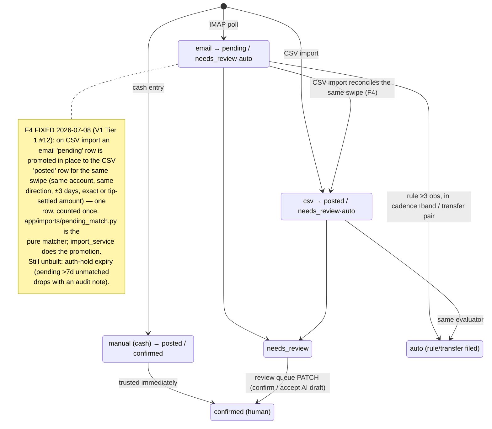
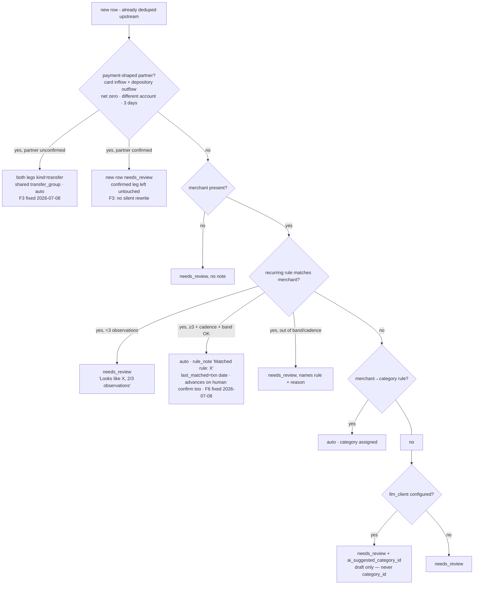
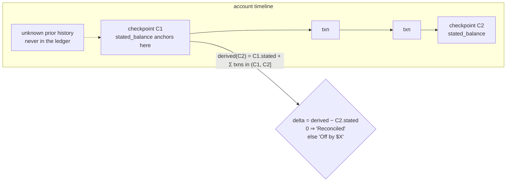
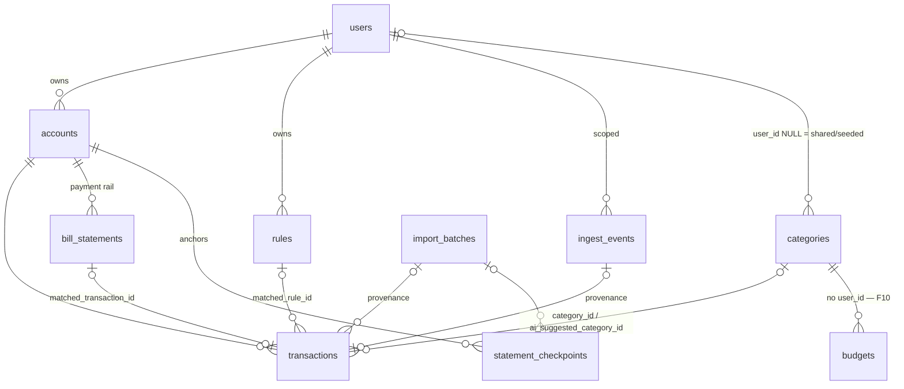

# ARCHITECTURE.md — Magpie (software-level)

> **Status: Phases 0–8 built and deployed (2026-07-05); remaining v1 work is tracked in
> [V1.md](V1.md), which supersedes CLAUDE.md §10's phase list** — including the
> severity-ranked findings (F1–F18) of the 2026-07-05 deep code review of the correctness
> core. Server: SSO-only auth, the full data
> model, `app/ledger/` (classify/rollups/balances/per-category, all pure and exhaustively
> tested), accounts/categories/transactions CRUD, CSV reconciliation (`app/imports/`), email
> ingestion (`app/ingest/`), the rules engine + review queue, bill matching + the first ntfy
> alert, budgets, and the AI category-draft guardrail (`app/rules/`, `app/services/{bill,
> sweep,budget}_service.py`, `app/services/ai/`) are live at
> `https://dragonfly.tail2ce561.ts.net`. Android: Home/Transactions/CashEntry/Accounts/
> Review-queue/Bills on Retrofit+Room+Hilt+navigation-compose, with Roborazzi baselines for
> **four** of the six (Home ×2 states, Accounts, Review queue, Bills — Transactions and
> CashEntry have none; V1.md Tier 4 closes that). **Known gaps, all deliberate, none
> silent:**
> 1. The suite SSO client `magpie` is not yet registered on dragonfly-id, so on-device sign-in
>    can't complete end-to-end — see "Open items" below.
> 2. The CSV parser is generic/institution-agnostic (no real per-issuer sample exports were
>    available when it was built) — importing real 12-month history is a human step.
> 3. **Email ingestion has real parsers for three issuers — Amex, US Bank, and Discover —
>    built from the real corpus (updated 2026-07-08).** US Bank's coverage grew from Zelle-only
>    to the account-wide "Your transaction is complete." alert (ordinary debits **and**
>    deposits/paychecks). Discover — which Phase −1 had found push-only — now emails a
>    "Transaction Alert" with clean labeled fields (Merchant/Date/Amount/Last-4), so it has a
>    real parser. The Visa account in CLAUDE.md's Phase −1 scope is **out of v1** (owner set up
>    alerts on US Bank/Amex/Discover only). Exact senders: `AmericanExpress@welcome.americanexpress.com`,
>    `usbank@notifications.usbank.com`, `discover@services.discover.com`.
> 4. **The ingestion routing changed from a forwarding mailbox to main-account IMAP scoped by
>    label (2026-07-08).** The original design forwarded the `magpie-ingest`-labelled alerts to a
>    dedicated mailbox so Magpie's credential saw only alerts (least privilege). Gmail forwarding
>    proved too fragile (its verification hit Google's anti-automation wall repeatedly), so the
>    approach is now: the poller connects to the **main account** (`IMAP_USER`) and selects the
>    **`magpie-ingest` label** (`IMAP_LABEL`). Tradeoff, deliberately accepted: the app password
>    can technically read the whole main inbox, but the poller is read-only by behavior
>    (`BODY.PEEK`, never marks/moves/deletes) and only ever selects the label. **LIVE as of
>    2026-07-08:** the app password is wired (`IMAP_PASSWORD`/`INGEST_USER_EMAIL` in `server/.env`,
>    `MAGPIE_IMAP_HOST`/`MAGPIE_IMAP_USER` in the host root `.env`), and the first poll connected to
>    Gmail and parsed 22 real Amex alerts. They sit `outcome=unparsed` only because the owner's real
>    accounts (with last4s) don't exist yet — a "Test" account is all there is; once the real
>    accounts exist, new alerts auto-file (the 22 already-seen won't retro-file — no replay tool,
>    F15). Tier 1 #11 complete.
> 5. **Phase 5's rules engine auto-files transfers, recurring income/bills, and
>    merchant→category matches. Pending→posted matching is now built too (F4, 2026-07-08):** a
>    CSV-truth reconciliation pass merges an email-sourced pending row into the posted row for
>    the same swipe rather than creating a second — closing the rollup double-count.
> 6. **Phase 6's bill matching and "missing bill" detection are fully built and tested, but
>    there is still no `bill_issued` *email* parser for any issuer.** Real "statement ready"
>    emails with genuine structured data (statement date, balance) were confirmed for
>    Discover specifically during this phase — but the exact sender address couldn't be
>    confirmed (repeated attempts to open a sample email hit browser-automation flakiness),
>    and per the same Phase −1 discipline that kept Discover's transaction parser unbuilt,
>    guessing at the address here would be the same mistake. Bills exist today only via
>    `POST /bills` (manual/CSV-adjacent creation) — real bill-issued emails becoming
>    `BillStatement` rows automatically is a fast-follow once a sender is confirmed. Sweep
>    alerts (2026-07-08): **unparsed-backlog + missing-bill** are built and latched on a
>    **persisted** latch (`alert_latches`, F11 — survives redeploys), meeting the "a simulated
>    missing bill pages the phone" exit; **paycheck late/short, per-account freshness, and
>    auth-hold expiry** are the remaining three (same latched pattern).
> 7. **The AI category-draft guardrail is fully built and tested against a fake LLM — the
>    real `LmStudioClient` has never been exercised against a live LM Studio instance**
>    (`llm_base_url` is unset in production; the AI stage silently never fires until it's
>    configured). **No Android Budgets screen exists yet** — `GET/POST /budgets` and
>    per-category actuals are live server-side, but the screen wasn't built this pass to
>    keep pace across phases; it's a small, well-understood gap, not an unknown one.
>    "First insights" (plain-language summary text, CLAUDE.md's other Phase 7 scope item)
>    is also not built — only category-suggestion drafts are.
> 8. **Phase 8 (suite membership) is now running end-to-end** (verified 2026-07-05, later
>    the same day as the "not yet" version of this note): the `magpie` runner service is
>    installed and Running, the repo Actions variables/secrets are set (CI, Release, and
>    Deploy all green on real pushes — the deployed `/version` reports the HEAD commit),
>    `Test-SuiteInvariants.ps1` carries the Magpie tunnel exemption + `tailscale serve`
>    check, and `Backup-DragonflyDatabases.ps1` includes magpie-db. **Still open:** the
>    uptime-kuma monitor (unverified), and — load-bearing — **the NAS dumps are not
>    encrypted yet** (host ROADMAP2 Tier 1 #10), which is V1.md's Tier 0 gate: magpie-db now
>    rides the nightly unencrypted backup, so real financial data must not enter the DB
>    until that lands.
>
> Per the suite docs rule, convert each section to as-built language in the same PR that
> lands it. Suite-level context: `C:\Code\ARCHITECTURE.md`. Build spec + locked decisions:
> [CLAUDE.md](CLAUDE.md). Post-v1 direction: [ROADMAP.md](ROADMAP.md).

Magpie is household cash-flow tracking with a review-not-enter product law: money events
arrive automatically (alert emails, monthly CSV), deterministic rules file the regular ones,
the local LLM drafts the rest, and the human sees a review queue and deviation alerts.

## System shape

```
Android (Kotlin/Compose) ⇄ Tailscale Serve (HTTPS, MagicDNS) ⇄ FastAPI :8005 ⇄ Postgres :5436
   phone must be on tailnet          │
   (ntfy precedent)                  ├→ IMAP (Gmail label "magpie-ingest") — in-process poller
                                     ├→ LM Studio :1234 (category drafts, insights)
                                     ├→ ntfy :8095 (topic magpie-alerts)
                                     └→ dragonfly-id JWKS (SSO verification, outbound HTTPS)
```

## Diagrams (added post-review 2026-07-05 — the two invariants the code review found broken, F1/F4, were exactly the un-diagrammed ones)

### Transaction lifecycle — status × review_state (the F4 trap made visible)



### Rule evaluation — the order every new row goes through (built, Phase 5/7)



### Balance anchoring — the F1-correct semantics (as-built 2026-07-08; `derived_balance`/`reconciliation_delta`)



### Data model — the ten tables (built, migrations 0001–0004; migration 0005 seeds the shared category vocabulary — V1.md Tier 1 #8)



## Deviations from the suite app pattern (all deliberate, all locked)

| Suite norm | Magpie | Why |
|---|---|---|
| Public hostname via Cloudflare tunnel | **Tailnet-only** (Tailscale Serve fronts loopback :8005) | Financial data gets zero internet attack surface; phone is already on the tailnet |
| Password auth + optional SSO | **SSO-only** (no register/login endpoints) | BROKER.md 2e pilot; smallest possible auth surface |
| Synthetic smoke registers a password account | Smoke mints a **suite token** | No password path exists |
| Request-driven server only | **In-process background poller** (FastAPI lifespan task for IMAP) | First app needing scheduled ingestion; one container beats a worker sidecar at this scale |
| — | **Read-only invariant**: nothing on this box can move money | The security identity of the app |

Everything else follows Cookbook: compose layout (minus cloudflared), Alembic
migrate-on-boot, `/health` + `/version`, slowapi, pydantic-settings, NullPool test conftest,
Pulse composite build, suite signing/release/deploy conventions.

## Server design (`server/`)

### The two pure domain packages (the correctness core — no I/O, table-driven tests)

- **`app/ledger/`** (built, Phase 2–3) — `classify.py` (sign-convention enforcement: spend < 0,
  income/refund > 0, transfer-pair zero-sum invariant) + `rollups.py` (monthly income/spend/net,
  transfers excluded, refunds netted into spend not income) + `balances.py` (**Phase 3, F1
  fix 2026-07-08** — an account's OWN balance, deliberately distinct from the household rollup:
  it includes every transfer leg, since money genuinely moved through that specific account.
  `derived_balance` anchors at the earliest `statement_checkpoint`'s stated balance and adds
  only transactions dated after it — prior history the ledger never saw is already inside that
  stated balance, so it can't be summed twice; `reconciliation_delta` is the ledger-vs-statement
  honesty meter, checking whether the ledger accounts for all movement between the earliest and
  latest checkpoints. Anchoring is what makes the statement-parity gate reachable after a
  backfill). 34 table-driven tests total. Per-category and vs-budget rollups are not built yet (Budgets CRUD is Phase 7 per
  CLAUDE.md's own phase list). If a number on the phone is wrong, the bug is here or in what
  feeds it — the `nutrition/` / `lists/merge.py` precedent.
- **`app/imports/csv_parser.py`** (built, Phase 3) — pure, no DB: auto-detects Date/
  Description/Amount-or-Debit+Credit/Balance columns from common header aliases (deliberately
  generic rather than per-issuer). Handles `$1,234.56`, parenthetical-negative `(12.34)`,
  and six date formats. 28 tests. **`app/imports/institution_mappings.py` (F5, 2026-07-08)**
  reconciles the file's sign convention with the ledger's (negative = outflow): `resolve_sign_flip
  (institution, override)` — `import_csv` flips every row's sign when the institution default
  (Amex = positive-is-charge) or an explicit per-import override says so, *before* the sign→kind
  derivation. Without it an Amex backfill would book every charge as income. Discover (a card,
  likely also positive-is-charge) is deliberately left out until a real export confirms it.
- **`app/rules/`** (built, Phase 5) — `clock.py` (the injected time seam — `SystemClock` in
  production, `FixedClock` in tests, so cadence/band logic gets real time-travel tests)
  + `recurrence.py` (cadence windows — weekly/biweekly/monthly ± `slack_days`, monthly
  clamps to the last valid day so Jan 31 → Feb 28 doesn't crash) + `bands.py` (rolling
  median ± pct tolerance, compared on magnitude so a $45 bill and a refund-shaped -$45 read
  the same) + `merchant_match.py` (**F8 fixed 2026-07-08** — normalization strips card-network
  noise like `SQ *` / trailing transaction IDs, but the prefix now requires a real separator so
  it no longer chews mid-word — SPOTIFY/POSTAL/POSTMATES survive; and matching is now *one-way*
  containment: the rule pattern must appear within the observed merchant, so a broad rule
  ("AMAZON") matches a specific merchant ("AMAZON PRIME") but the specific "AMAZON PRIME" rule
  no longer mis-fires on a plain "AMAZON" purchase) + `transfer_matching.py`
  (**F3 fixed 2026-07-08** — pairs only a *payment-shaped* pair: the `card` leg is the
  positive inflow, the `depository` leg the negative outflow, net zero, different account,
  within a day window. Requiring the card-payment shape — not merely two ±equal amounts —
  stops a card spend and a coincidental same-amount deposit from fusing into a bogus transfer;
  non-card internal moves fall through to review. The confirmed-partner guard and the un-pair
  path live in the transaction service). All pure, 23 table-driven tests. Deviation detection (missing bill / out-of-band / short-paycheck) is
  Phase 6, not built yet — the clock/band primitives exist, the alert sweeps that use them
  don't.

### The ingestion pipeline (`app/ingest/`)

```
Gmail filter (main account) → label "magpie-ingest" → IMAP poll of that label (lifespan task)
  → per-issuer parser (Amex / US Bank / Discover, by exact sender — Visa out of v1)
  → dedupe (message-id + payload hash → ingest_events)
  → account resolved by last4 hint → transaction row (status=pending, needs_review)
      (date = parser's date, else the receipt timestamp in owner-local tz — F18, `app/time_util.py`)
  → no matching account, or no recognized template → outcome="unparsed"
CSV/OFX import (monthly) → institution mapping → reconciles against email-sourced pending
  rows first (F4: promote the pending swipe to posted in place), else creates a new posted row
Manual entry (cash only) → same pipeline tail
```

**Testability seams (architectural):** four injected dependencies, each one interface with
a fake — the **clock** (`rules/` and all sweeps take `now`; every recurrence/expiry/
freshness test is a time-travel test — not built yet, Phase 5), **the IMAP fetcher** (built,
Phase 4 — see below), the LLM client, and the ntfy publisher (alert tests assert **latching**:
one publish per condition episode, not per sweep — not built yet). Nothing in the pipeline
reads a wall clock or opens a socket directly.

**Built (Phase 1):** the suite-token test helper — `tests/conftest.py` generates one local RSA
keypair per test session and stubs the JWKS fetch, so tests mint valid RS256 suite tokens
without a real dragonfly-id (the only way to get an authenticated test client at all, since
Magpie has no password login). **Gotcha discovered building it:** `tests/` has no
`__init__.py`, so pytest's own conftest auto-discovery and a test file's
`from tests.conftest import suite_token` load **two separate module instances**, each running
the module-level keygen once — a token signed via one and verified via the other's JWKS fails
100% of the time. Fixed by exposing the helper as a fixture (`make_suite_token`) rather than an
importable function; fixtures always resolve through pytest's single cached module. Future test
files should request the fixture, not import the function.

**Built (Phase 4, extended 2026-07-08):** `app/ingest/parsers.py` — pure, no I/O — dispatches by
exact sender to three issuer parsers:
- **Amex** — "Large Purchase Approved" (spend) / "Merchant credit/refund was issued" (refund).
- **US Bank** — the account-wide "Your transaction is complete." alert (**"transaction of"** = debit→spend,
  **"deposit of"** = money in→income, i.e. the paycheck path; no merchant, filled by CSV) **plus** the
  Zelle alert. **F7:** Zelle *direction* is read from the body — received→income, "you sent"→spend,
  ambiguous→`UnparsedEmail` rather than assumed income. `parse_version` `3` (was `2` for F7).
- **Discover** — "Transaction Alert" (a card charge → spend; pending pre-auth, reconciled to the
  posted amount by CSV). Clean labeled fields (`Amount:`/`Merchant:`/`Date:`/`Last 4 #:`) parsed
  precisely so the `$1 authorization` boilerplate can't be mistaken for the amount.

Each extracts amount, merchant, date, and a last4 hint via regex against the real corpus's
structure; anything else — an
unrecognized subject, a recognized subject with no dollar figure, or a resolved parse with no
matching account — raises `UnparsedEmail` and becomes an `outcome="unparsed"` `ingest_event`,
never a crash and never silent data loss. **F16 (fixed 2026-07-08):** account resolution by
last4 now degrades to unparsed when two accounts share a last4 (a card and a checking account,
say) instead of raising `MultipleResultsFound` and aborting the whole poll batch.
**Two real bugs the tests caught before deploy:** the amount regex originally matched the
*first* dollar figure in an Amex body, which is the alert-threshold sentence ("...was more
than $1.00"), not the real charge that appears later — fixed to anchor on the *last* match.
And the merchant-extraction word-walk broke on a trailing hyphen a signed amount leaves behind
("...ONLINE -$18.00"), silently falling back to the entire flattened sentence — fixed by
stripping trailing separator punctuation first.

`app/ingest/imap_client.py` is the injected IMAP-fetcher seam: `RealImapFetcher` issues
`BODY.PEEK[]` (never plain `BODY[]`), so polling never sets the `\Seen` flag — the mailbox
stays read-only *by construction*, not just by convention (CLAUDE.md §8). Since flags are
never touched, "already processed" is tracked entirely by `ingest_events.message_id`, and
every poll re-scans a rolling window. `FakeImapFetcher` is the test double; `tests/fixtures/
*.eml` are sanitized (fabricated amounts/merchants/last4s) but structurally real, and
`test_ingest_service.py` feeds them through the actual parsers and a real throwaway DB — the
mock-the-seam E2E pattern, with only the socket faked. `app/ingest/poller.py` is the lifespan
background task (wired in `app/main.py`); it only starts if `imap_host` is configured, the
same "absence disables the feature" pattern as `suite_jwks_url`. `GET /ingest/events` is the
unparsed-backlog operator view; `POST /ingest/poll` triggers an out-of-band poll for
verification without waiting out the interval.

**Pending→posted matching against CSV truth is built (F4, 2026-07-08):** on CSV import an
email-sourced pending row and the CSV-imported posted row for the same swipe merge into one
reconciled row (`app/imports/pending_match.py` is the pure matcher — same account, same
direction, ±3 days, exact or tip-settled amount; `import_service.py` promotes the pending row
in place, keeping its email provenance and any human/rule decision). This closes the F4
double-count. **Not built yet, called out rather than silently skipped:**
the clock-driven sweeps (auth-hold expiry, freshness alerts); and
the ntfy unparsed-backlog alert. **The live proof of the whole pipeline — a real swipe
appearing as a pending transaction within one poll interval — has not happened yet**: it
needs IMAP credentials for the dedicated ingestion mailbox, which is blocked on finishing
Gmail's forwarding verification (see the status header). What's shippable *right now* is
everything upstream of that one external credential.

Design rules: parsers are one module per issuer with **committed sanitized `.eml` fixtures**
(public repo — nothing real in git); an email that parses to nothing becomes an `unparsed`
ingest_event surfaced in an operator view (+ ntfy on backlog growth, once Phase 6 lands ntfy)
because a silently broken parser is the pipeline's worst failure mode (the ledger quietly
goes stale); the ingest code never mutates the mailbox (read-only by behavior, enforced via
`BODY.PEEK[]`, not just documented); every transaction carries provenance (`source` +
`ingest_event_id`) so any number is traceable to the email that produced it.

### Rules evaluation order (deterministic first, AI last — always)

**Built (Phase 5), wired into both `import_service.py` and `ingest_service.py` so every
CSV row and every ingested email goes through the same evaluator — `app/services
/rule_service.py::evaluate_transaction`:** 1. dedupe (already done upstream by each caller
before a row ever reaches the evaluator) → 2. transfer matching (a payment-shaped pair —
card inflow + depository outflow netting to zero on different accounts, F3 — ⇒ both legs
`kind="transfer"`, `review_state="auto"`, no review; a *confirmed* would-be partner is left
untouched and the new row routes to review instead) →
3. recurring income/bill rules (≥3 observations + within cadence window + within amount band
⇒ auto-filed with `rule_note` = `"Matched rule: X"`; below threshold or out of band ⇒
`needs_review` with an explanation naming the rule and the reason). **F6 (fixed 2026-07-08):**
the rule's `last_matched_at` is anchored to the matched transaction's *date* (not wall-clock
`now`), and confirming a rule-flagged row in the review queue advances the rule's window too —
so a single missed/out-of-band occurrence the human corrects no longer derails the rule
forever. → 4. merchant→category
rules (deterministic category assignment ⇒ auto) → 5. **(built, Phase 7)** if `llm_client`
is supplied and nothing above matched, the LLM proposes a category —
`app/services/ai/categorize.py::suggest_category` writes the result to
`ai_suggested_category_id` **only**, never `category_id`, and `review_state` stays
`needs_review` regardless: accepting a draft is the review queue's "Accept AI suggestion"
action (a human `PATCH`, CLAUDE.md §6's "nothing the model produces is persisted without
explicit confirmation" made literal). Falling through with no `llm_client` configured (the
production default today — see the status header) behaves exactly as before Phase 7: plain
`needs_review`, no draft. **A rule only ever decides *category*, never *kind*** — the
amount's sign is the single source of truth for spend/income/refund
(`app/ledger/classify.py`), so a mismatched rule can never force an
invalid sign combination onto a transaction.

**Cold start:** no rule auto-files until ≥3 observations, counted from *every* matching
transaction on that account regardless of whether it predates the rule — Phase 3's CSV
backfill history counts the same as live events, exactly as CLAUDE.md's cold-start bar
intends. Below threshold, the review queue shows *why* ("Looks like XCEL ENERGY, 2/3
observations"), not just that it needs a look. **F14:** that observation lookup prefilters the
merchant substring in SQL (`merchant_norm ILIKE %matcher%`, both stored already-normalized)
instead of loading + Python-normalizing the whole account table per evaluated row; the exact
one-way `matches()` stays the Python authority. `GET /transactions` also gains opt-in `limit`
(≤500)/`offset` (default unbounded — review queue unchanged); the Android infinite-scroll is Tier 4.

**The AI guardrail (built, Phase 7):** `app/services/ai/llm_client.py` is the fourth and
final injected seam (clock, IMAP fetcher, ntfy publisher, now the LLM client) —
`FakeLlmClient` for tests, `LmStudioClient` for a real local (never hosted) OpenAI-compatible
endpoint. `app/services/ai/categorize.py::suggest_category` enforces the vocabulary
guardrail directly: the prompt lists only the user's own category names, the response is
Pydantic-validated, and a category the model invents outside that list is silently
rejected — `None`, never a guessed fallback. The prompt sees only DB-derived transaction
facts (merchant, amount, kind) and the category vocabulary, never a raw email. Guardrail
tests (`test_ai_categorize.py`) pin all four failure modes (malformed JSON, missing field,
out-of-vocabulary answer, zero categories available never even calling the model) plus a
happy path — all against `FakeLlmClient`, exactly CLAUDE.md's "IMAP + LM Studio + ntfy
always mocked in CI" rule.

**Bill matching (built, Phase 6):** `app/rules/bill_matching.py` — pure — pairs a
`BillStatement` to the closest-dated payment on its bound account (CLAUDE.md §2: each
biller rides one payment rail) within a 10-day window either side of the due date, exact
amount only; `is_bill_missing` answers the time question (due date + a 3-day grace passed,
still unmatched) that `app/services/bill_service.py` combines with "no match yet" to decide
`is_missing`. `POST /bills` tries an immediate match (a backfilled historical bill
shouldn't sit "missing" forever) and `POST /bills/{id}/rematch` re-checks after a later
import/poll brings in the settling payment.

**Alert latching:** `app/rules/alerts.py::should_alert` — pure, fires only on the true rising
edge, stays silent while a condition persists, fires again if it resolves and recurs (CLAUDE.md's
"once per episode, not once per sweep"). **F11 (2026-07-08):** that "already alerted?" bit is now
**persisted data** — `app/services/alert_latch_service.latched_should_alert` reads/writes an
`alert_latches` row keyed per condition (migration `d5f2a1b3c4e6`), so a redeploy no longer
re-pages a still-open condition (the old sweep held it in process memory and reset on every
container recreate). **`app/services/ntfy_client.py`** is the fourth injected seam
(`FakeNtfyPublisher` records, `HttpNtfyPublisher` POSTs). **Built + wired into the lifespan sweep
loop: four latched alerts** — unparsed-email backlog, **missing-bill** (an overdue unmatched
`BillStatement` past an owner-local due-date grace, F18 — the "a simulated missing bill pages the
phone" exit), **paycheck-late** (a `recurring_income` rule whose expected paycheck — cadence +
`last_matched_at` — is overdue past its slack; clears when F6 advances the rule on arrival), and
**per-account freshness** (an account with prior `ingest_events` activity but none in
`account_freshness_days`, so alert-decay is caught; no-history accounts skipped so nothing
false-alarms). Checked every `sweep_interval_minutes`; 12 time-travel tests in
`test_sweep_service.py`. **Remaining:** **auth-hold expiry** (a data-*mutation* sweep — drop stale
pendings) and paycheck-*short* (band-based, better at ingestion). **Cash rule** (the ATM withdrawal
*is* the spend) is still target design, not built.

### Domain map

**Built (Phase 0–7):** `app/main.py` (`/health`, `/version`), `app/routers/suite_auth.py` +
`app/services/suite_auth.py` (suite login), `app/routers/auth.py` (`POST /auth/refresh` — a
Phase 1 gap: refresh tokens were minted but nothing could redeem them until this landed),
`app/security.py` (local HS256 session tokens). Full CRUD for accounts, categories, and
transactions (`app/routers/{accounts,categories,transactions}.py` +
`app/services/{account,category,transaction}_service.py`), all scoped to `CurrentUser` by
filtering on `user_id` in the query itself (never a separate ownership check — a cross-user
`test_*_not_visible_to_a_different_user` test pins this per domain). The **shared category
vocabulary** (Groceries/Dining/Transport/Utilities/Housing/Subscriptions/Entertainment/
Health/Shopping/Travel/Cash/Income/Other) is seeded with `user_id NULL` by migration
`c4e17a9b2d38` (V1.md Tier 1 #8) so a fresh user — and the AI stage — has a vocabulary from
first boot; `list_categories` returns the shared set plus the user's own. Category CRUD is
full — `POST` (create), `PATCH /categories/{id}` (rename, 2026-07-08), `DELETE` — with seeded
rows read-only: both the rename and delete routes scope by `user_id`, so a shared category
404s either way (the ownership filter is the read-only guard). `GET /transactions/summary`
is the Home month-panel read, backed by `app/ledger/rollups.py`; `AccountOut` now carries
computed `balance_cents`/`balance_delta_cents` (`app/ledger/balances.py`). `POST /imports/csv`
(`app/routers/imports.py` + `app/services/import_service.py`) parses via `csv_parser.py`,
dedupes against existing transactions by an (account, date, amount, description) fingerprint
**by multiplicity, not existence (F9)** — it counts how many of each fingerprint already exist and
lets each file row consume one, so two genuinely distinct same-day duplicates both survive and
re-import stays idempotent (the old boolean check skipped the second, and crashed on re-import once
two identical rows existed) — creates `needs_review` transactions
(kind guessed from sign only — a CSV row is never a manual confirmation), and optionally a
`StatementCheckpoint` when a Balance column is present. `POST /ingest/poll` + `GET
/ingest/events` (`app/routers/ingest.py` + `app/services/ingest_service.py`) are the email
pipeline's manual-trigger and operator-view surface. All ten §4 tables exist as SQLAlchemy
models; migration `0002` (Phase 4) added `ingest_events.raw_payload` (the actual body, not
just its hash — needed so a fixed parser can replay history, which the Phase 1 migration's
comment promised but the columns didn't yet back) plus `account_id`/`user_id` for scoping.
Migration `0003` (Phase 5) added `rules.user_id` (the same CurrentUser-scoping gap
`ingest_events` had before Phase 4, caught the same way) plus `transactions
.matched_rule_id`/`rule_note` — the review queue's "why", captured as a fact at evaluation
time rather than re-derived later from whatever the rule looks like now. `GET/POST /rules`,
`GET/PATCH/DELETE /rules/{id}` (`app/routers/rules.py` + `app/services/rule_service.py`) are
plain CurrentUser-scoped CRUD; `PATCH /transactions/{id}` gained `review_state` and `kind`
(the review queue's confirm/correct action — `kind` only re-validates the sign invariant
when supplied, never blindly trusted; and changing a transfer leg's kind away from
`"transfer"` now dissolves the whole `transfer_group` so no dangling half-group is left, F12);
`POST /transactions/{id}/unpair` dissolves a transfer pair explicitly (both legs revert to
their sign-based kind and return to review, F12); `GET /transactions?review_state=needs_review`
is the review queue's read. **Transaction splits (Tier 3 #26, 2026-07-08, migration
`f3b8c2e9a1d7`):** `POST /transactions/{id}/split` (parts must sum to the amount, ≥2, sign-valid,
not a transfer/already-split) creates child allocations (`split_parent_id` set) and marks the
parent `is_split`; `DELETE …/split` reverses it. No double-count by construction — the parent stays
the ledger row (balance/list/month totals filter `split_parent_id IS NULL`) while the parts carry
the category breakdown (budget rollup filters `NOT is_split`); 7 tests pin that month total +
balance are unchanged by a split while budget actuals move to the parts. **The split *UI* landed
2026-07-09** (Tier 4 #32): the Transactions screen opens `ui/transactions/SplitSheet.kt` — a
`ModalBottomSheet` wrapping a pure `SplitSheetContent` allocator (parts of category + amount, live
remaining, Split enabled only when the parts sum to the total) → `POST /transactions/{id}/split`;
`is_split` was added to the Android `TransactionOut`, split parents show a "Split" tag and aren't
re-splittable. The interactive allocation still needs an on-device pass (Roborazzi covers layout only). `GET/POST /bills`, `POST /bills/{id}/rematch` (`app/routers/bills.py` +
`app/services/bill_service.py`) — no migration needed: `BillStatement.account_id` is
required, so it scopes via the same join-to-`Account.user_id` pattern Phase 3's
`StatementCheckpoint` already established, no nullable-join gap to close. `is_missing` is
computed at read time (`_to_out()`, mirroring `AccountOut`'s balance fields from Phase 3),
never stored. `GET/POST /budgets` (`app/routers/budgets.py` + `app/services/budget_service
.py`) — **`Budget` gained `user_id` (F10, migration `e7c1a9d4f0b2`, 2026-07-08)** when the Budgets
screen landed: before it, `list_budgets(month)` returned *every* user's rows for the month (the
smoke client's throwaway user is a real second user in prod), so the screen would have leaked
cross-user budgets. The column is nullable/additive (safe against pre-scoping orphans, which then
match no user); `create_budget` sets it and `list_budgets(user_id, month)` filters it, with a
cross-user scoping test. `actual_cents` is computed at read time via the new
`app/ledger/rollups.py::rollup_by_category` across every one of the user's accounts for
that category+month. Migration `0004` (Phase 7) added `transactions
.ai_suggested_category_id` — a draft, never a confirmed fact, kept structurally separate
from `category_id` so an AI suggestion can never be mistaken for a human/rule decision.
`GET /cashflow` (`app/routers/cashflow.py` → `cashflow_service` → pure `app/rules/cashflow.py`,
Tier 3 #23, 2026-07-08) is the "due before next paycheck" projection: the next paycheck (soonest
`expected_next_date` across recurring-income rules) + the account's unmatched upcoming bills, each
flagged `is_overdue`/`before_next_paycheck`. Consumed by the Android `ui/cashflow/` screen (see the
Android section).

**Planned (Phase 8):** suite membership + release + operational fit — see CLAUDE.md §10.
No further domains are planned beyond that; Phase 7 was the last content phase.

**Deferred fast-follow, not a full phase:** pending→posted matching between email-sourced and
CSV-sourced rows for the same swipe (see the ingestion pipeline section above); an Android
Budgets screen (server-side is live, no UI yet); "first insights" plain-language summaries
(CLAUDE.md's other Phase 7 scope item — only category-suggestion drafts were built).

## Android design (`android/`, package `com.magpie`)

Suite MVVM (Room + Retrofit + Hilt), Pulse composite build, **teal accent**
(`PulseAccent.Teal` — added to the library in Phase 0). Channel semantics (`MagpieTheme.kt`):
teal = money/primary, green = income/under-budget, amber = needs-review, a red channel built
locally from Pulse's proven `PulseRed`/`PulseRedDeep` (not a new library accent) =
over-budget/deviation.

**Design-parity + color review (2026-07-05, vs Spotter/Plate/Cookbook — the work is V1.md
Tier 4):** the screens are functionally correct but sit at Spotter's pre-PULSE-redesign
fidelity. Concretely missing vs every sibling: the hero greeting panel (the "magpie"
indigo→teal→green gradient is plumbed into `MagpieTheme.heroGradient` and **used by no
screen**), a bottom nav shell (Home is a stacked-button menu), content on Home (siblings show
today's data; Magpie shows links), compact stat-tile values (`$4,500.00` wraps across three
lines — siblings keep tile values short), and designed empty/error states. **Color grammar
as-used contradicts the theme's own docstring**: `overBudget` red paints every ordinary
spend row and every negative account balance (the app's most common datum wears the alarm
color; a card's normal statement balance reads as an error), Bills colors the *amount* by
paid/missing status (a green −$45 breaks the sign grammar), and teal carries four unrelated
meanings (primary, net/transfer, awaiting-payment, AI-suggestion text). Corrective rules,
binding for Tier 4: ordinary spend + normal balances = neutral foreground; red strictly for
over-budget/out-of-band/missing; Bills colors the status word, never the amount; teal =
brand/primary + money-total only; AI drafts get their own voice (violet — unclaimed inside
Magpie); ≤2 channels per card. What was right and stays: the green/amber assignments, the
channel-triple structure, and deriving red from proven Pulse hues instead of inventing new
ones.

**Built (Phase 2):** `data/remote/` — `ApiService` (Retrofit + kotlinx-serialization),
`AuthInterceptor` + `TokenRefreshAuthenticator` (mirrors Spotter/Cookbook's hardened
authenticator: serialized refreshes, only an explicit auth rejection signs out, a transient
network failure mid-refresh keeps the session), `SuiteAuthManager` (AppAuth PKCE — see the open
item below). `data/local/db/` — `PendingCashEntryEntity` + `CashEntryDao` (Room, the offline
cash-entry queue only — no broader read cache yet). `data/repository/TransactionRepository` —
the write-through: tries the server immediately, catches only `IOException` (genuine offline)
to queue locally, lets any HTTP error propagate as a real bug rather than a silent queue (5
repository tests against fakes pin this distinction, the `nutrition`/`merge.py`-style
correctness core on the client side). `util/NetworkSyncObserver` drains the queue on
reconnect (Cookbook's `NetworkSyncObserver` precedent).

Screens: `ui/signin/SignInScreen` ("Sign in with Dragonfly," the only auth path) ·
`ui/home/HomeScreen` (month in/out/net panel via `HomeContent`, gates on having ≥1 account —
shows an inline create-account form instead of the summary when none exist, and now links to
Accounts, Review queue, Bills, and Settings) · `ui/transactions/TransactionsScreen` (list) ·
`ui/cashentry/CashEntryScreen` (the offline-capable manual entry form) ·
`ui/accounts/AccountsScreen` (**Phase 3** — lists accounts with computed balance + a
"Reconciled"/"Off by $X" delta line when a checkpoint exists; each row has an "Import CSV"
action opening a dialog: institution field, `ActivityResultContracts.GetContent()` file
picker, multipart upload via `ApiService.importCsv`) · `ui/reviewqueue/ReviewQueueScreen`
(**Phase 5, extended Phase 7** — `GET /transactions?review_state=needs_review`; each row
shows the amount, merchant, and `rule_note` when a rule fired but didn't clear the
auto-file bar — CLAUDE.md's "the review queue shows why" made literal on-screen. **Phase
7:** a row with `ai_suggested_category_id` instead renders "AI suggests: {category name}"
in a visually distinct color/label with its own "Accept AI suggestion" action, never the
plain "Confirm" button — the exact CLAUDE.md Phase 7 exit bar, "review queue shows AI
suggestions distinctly from rule hits." Category names are resolved client-side from `GET
/categories`, fetched alongside the queue. **V1 Tier 1 #9 — the "correct" half of
approve/correct:** every row also carries a tonal "Correct" action opening a `ModalBottomSheet`
(the full category list + a kind selector for the rare sign-ambiguous case); tapping a category
confirms immediately, so the happy path stays one tap and a correction is at most two. All three
paths — accept-as-is, accept/pick a category, correct the kind — go through one
`ReviewQueueViewModel.confirm(id, categoryId?, kind?, ruleMatcher?)` → `PATCH /transactions/{id}`
(`review_state=confirmed`, null = leave untouched); a bad kind change surfaces the server's sign
re-validation error and leaves the row in the queue. **Tier 3 #22 "make this a rule" growth loop
(2026-07-08):** the sheet also carries an "Always file '<merchant>' this way" checkbox — ticking it
then picking a category passes a `ruleMatcher`, and `confirm` creates a `merchant_category` rule
(`POST /rules`, matcher = the txn merchant, server-normalized) *after* the confirm, so future
transactions from that merchant auto-file and skip the queue.) · `ui/bills/BillsScreen` (**Phase 6** — `GET
/bills`; each row shows the biller, due date, and a Paid/Missing/Awaiting-payment status
derived from `matched_transaction_id`/`is_missing`; the flat bills list, now the detail view
behind the calendar) · `ui/cashflow/CashflowScreen` (**Tier 3 #23, 2026-07-08** — the "due before
next paycheck" headline: a paycheck header from `GET /cashflow` (`next_paycheck_date` + total due
before it) over the upcoming bills split into "Due before next paycheck" / "After payday" sections,
each row colored by the corrected grammar — red only when overdue, amber for the before-payday set,
teal otherwise; linked from Home; light+dark Roborazzi baselines).
`ui/navigation/MagpieNavHost` gates the whole graph on `AuthGateViewModel.isSignedIn` (a
`TokenStore` Flow) — no explicit post-sign-in navigation call is needed, since saving a
session makes the Flow re-emit. **Tier 4 #27 (2026-07-08, mirrors `CookbookBottomBar`):** the
signed-in graph is wrapped in a `Scaffold` + `MagpieBottomBar` (`TopLevelDestination` = Home ·
Activity · Bills · Budgets · Settings; teal money-channel selection) shown only on top-level
routes, with Cookbook's `goTab` save/restore navigation; tab screens dropped their back buttons
while secondary screens (Accounts, Review queue, Cash flow, Rules, Cash entry) are pushed and keep
theirs. `ui/budgets/BudgetsScreen` (**Tier 3 #25, 2026-07-08** — the
month-vs-budget view: `GET /budgets?month=` for the current month with category names from `GET
/categories`, each row an actual-vs-budget `LinearProgressIndicator` with "$X left"/"Over by $X",
over-budget in the red channel and under in green; a FAB opens an add-budget dialog — category
picker + amount → `POST /budgets`; linked from Home; light+dark Roborazzi baselines).
`ui/rules/RulesScreen` (**Tier 3 #22, 2026-07-08** — the rules editor on the Phase-5 rules CRUD:
each rule shows its matcher, a human type label (Income/Bill/Transfer/Category rule) and a one-line
summary (cadence `kind ±Nd`, band `±N%`, `→ Category`, names from `GET /categories`), an
enable/disable `Switch` (optimistic → `PATCH /rules/{id}`, disabled rules drop to a muted channel),
and delete behind a confirm dialog (`DELETE /rules/{id}`); linked from Home; light+dark Roborazzi
baselines. The **"make this a rule" growth loop** landed 2026-07-08 in the review queue (below);
**deferred:** inline band/cadence editing). `ui/settings/SettingsScreen` (**V1 Tier 1 #10** — the category
editor: lists categories, the user's own (`shared=false`) get rename/delete affordances while
seeded/shared ones show a read-only "Shared" label (the server 404s a rename/delete of a shared
category), plus an "Add" action and an About block with the server `/version`. `SettingsViewModel`
wraps the existing `POST`/`PATCH`/`DELETE /categories` CRUD; the rules editor is deferred to Tier
3.) **Not built this pass:** badge counts on Home for the review queue's size or the bills-missing
count (CLAUDE.md's target design) — the screens exist, the Home-panel summary of either doesn't yet.

Each screen splits into a thin ViewModel-wired composable and a pure `*Content` composable
taking plain state + callbacks (`HomeScreen` → `HomeContent`, `AccountsScreen` →
`AccountsContent`) — the Roborazzi baselines screenshot the pure half directly, so no Hilt DI
is needed in the screenshot test. **A real layout bug was caught this way in Phase 2**: three
`StatTile`s in a `Row` without `weight()` silently overflowed off-frame — the recorded PNG
was the thing that surfaced it, not code review.

Offline model: the **only entry surface that's offline is cash entry** (the Room queue above);
everything else is online-first against the tailnet — no broader read cache yet (unlike
Cookbook's recipe cache). Acceptable because the phone is on Tailscale wherever it has signal.
Because Tailscale Serve provides HTTPS, the manifest needs **no cleartext exception** (unlike
Hawksnest's bare-IP problem).

### Open item: the `magpie` suite OAuth client isn't registered yet

`SuiteAuthManager` is wired for client id `magpie`, redirect `com.magpie:/oauth2redirect` — the
naming CLAUDE.md's Phase 8 section already commits to. But dragonfly-id's static client list
(`Dragonfly/server/app/oidc/clients.py`) only has `spotter`/`plate`/`cookbook`/`dragonfly`/
`localdev` today. **On-device sign-in cannot complete until `magpie` is added there** — a small,
additive change to a live production identity server, deliberately not made without a separate
go-ahead (same caution as the Pulse `PulseAccent.Teal` change: touching shared/live suite
infrastructure gets its own explicit authorization, not a silent side effect of an app-repo
task). CLAUDE.md's own Phase 8 scopes this registration there; it may make sense to pull it
forward once someone wants to actually test the sign-in flow on a phone.

## Trust boundaries

1. **Internet → Magpie: none.** No public DNS, no tunnel. Reachability = tailnet membership.
2. **Mailbox → Magpie:** a read-scoped-by-behavior IMAP session using a dedicated app
   password/OAuth token in `server/.env`; parser output is untrusted input (validated,
   bounded, deduped) — an attacker who can email you should at worst create a
   `needs_review` draft, never an auto-filed transaction (rules only auto-file against
   *learned history*, not novel senders).
3. **AI:** LM Studio local-only, sees DB-derived context (never raw emails), output
   Pydantic-validated, persists only through user confirmation.
4. **Money movement: impossible by construction** — no credentials with write power exist
   in this system, and no feature may introduce them (see ROADMAP.md non-goals: no bill pay).
5. **Backups:** Magpie's dumps ride the nightly NAS pipeline, which must be encrypted at
   rest first (host ROADMAP2 Tier 1 #10 — blocking precondition).

## Failure modes to design for (ranked)

1. **Silent parser rot** (issuer redesigns its email) → unparsed-event counter (built, Phase 4:
   `GET /ingest/events?outcome=unparsed`; the ntfy backlog alert itself is still Phase 6) +
   fixtures pinning every template (sourced from the Phase −1 real-email corpus) + raw
   payloads kept in `ingest_events.raw_payload` with `parse_version` so a fixed parser
   **replays history** — a bad parse is recoverable, never permanent. Already proved useful
   once: two real parser bugs (an amount regex anchored on the first dollar figure instead of
   the last, a merchant-name walk that broke on trailing punctuation) surfaced as test
   failures before deploy, not as silently wrong dollar amounts in production.
2. **Double-count via transfers or cash** → `ledger/` transfer semantics + pairing tests
   (every `transfer_group` sums to zero) + the ATM-is-the-spend cash rule; these are the
   classic self-built-tracker bugs and they're designed out at the model layer.
3. **Balance drift from reality** (unknown opening balance, missed events, interest) →
   `statement_checkpoints` (built, Phase 3) anchor the ledger to each statement's stated
   balance; the per-account delta is surfaced on the Accounts screen ("Reconciled" / "Off by
   $X"), and the **statement-parity gate** (two consecutive months to the penny
   post-reconciliation) remains v1's acceptance criterion — real bank CSVs, not the synthetic
   fixtures the parser is tested against, are what that gate actually measures.
4. **Pending/posted drift** (tip adjustments) and **auth holds that never post** → CSV
   reconciliation updates matched rows in place (not built); the expiry sweep drops
   unmatched pendings after ~7 days with an audit note (not built — `app/rules/clock.py`'s
   seam exists, nothing schedules this sweep yet).
5. **Alert-coverage illusion** (an account quietly stops alerting) → per-account "last event
   seen" freshness + a latched staleness alert via ntfy — **built (2026-07-08)**,
   `run_account_freshness_sweep` (`account_freshness_days`, default 14).
6. **Tailscale outage** → app degrades to cached reads; ingestion pauses and catches up
   (IMAP is pull — nothing is lost, the label retains the mail).

## Operational fit (host-side, Phase 8)

**Built (2026-07-05):**
- `magpie` registered as a static public OIDC client on dragonfly-id (`<package>:/oauth2redirect`
  = `com.magpie:/oauth2redirect`), plus a dedicated `POST /smoke/token` mechanism on dragonfly-id
  itself (a confidential `SMOKE_CLIENTS` credential, separate from the real OAuth client) so this
  SSO-only app's post-deploy synthetic smoke has something to mint a session token against — the
  §9 recommendation, implemented as designed.
- `release.yml` (suite key, `version.json`, apksigner pin — identical shape to the siblings) and
  `deploy.yml` + `deploy/redeploy.ps1` (the no-tunnel variant: no cloudflared step, health-gates
  on loopback `/health`, and takes a `pg_dump` snapshot into a repo-adjacent `magpie-db-backups/`
  directory *before* every `docker compose up -d --build`, keeping the last 5 — migrations run on
  boot against real financial history, so a bad migration is a restore, never a loss). Both
  verified end-to-end live on this host: `redeploy.ps1` run directly (snapshot → rebuild → health
  gate, all green) and `scripts/synthetic_smoke.py` run inside the server container against the
  live deploy (mint smoke token → `/auth/suite` → create/read/delete a transaction, all green).
- Dragonfly-side app onboarding: `magpie` added to `AppRegistry` + the manifest `<queries>` block
  (closes the update-channel gap) and to `ServiceRegistry` as a `SUITE`-probe,
  `TAILNET_ONLY`-reachability entry at `https://dragonfly.tail2ce561.ts.net` (this host's own
  Tailscale MagicDNS name) — the Suite status dashboard now carries Magpie, degrading to
  "off-network" rather than a false "down" for anyone off the tailnet. The config broker needed
  no code change: `SuiteConfigProvider` and the Settings "Managed app servers" card are already
  generic over `AppRegistry.apps`, so the registry entry alone is what makes
  `content://com.dragonfly.suiteconfig/config/magpie` resolve.

**Completed after the paragraph above was first written (verified live 2026-07-05):**
- The `magpie` self-hosted runner service (`C:\actions-runner-magpie`,
  `actions.runner.CDRaab01-Magpie.DRAGONFLY`, Running) and the `MAGPIE_DIR` /
  `MAGPIE_SMOKE_CLIENT_*` / `KEYSTORE_*` repo variables/secrets — proven by real green CI →
  Release → Deploy runs on `main` (the release-signing env-var read in `build.gradle.kts`
  needed a fix, commit `6ee45a8`, deployed and reporting via `/version`).
- `Test-SuiteInvariants.ps1`'s Magpie handling (tunnel exemption, SUITE_JWKS pin check, the
  Magpie-only `tailscale serve status` mapping assertion) and magpie-db in
  `Backup-DragonflyDatabases.ps1`'s dump list.

**Still open (V1.md Tier 0 / Tier 5):**
- **Encrypting the NAS dumps** (host ROADMAP2 Tier 1 #10) — the Tier 0 gate: magpie-db now
  rides the nightly backup *unencrypted*; no real financial data before this lands.
- The **uptime-kuma** monitor on `http://host.docker.internal:8005/health` (unverified).
- Pinning the smoke-token subject email on dragonfly-id to the designated throwaway address
  (V1.md F2 — least-privilege hardening of the smoke mechanism, per §9's original design).
