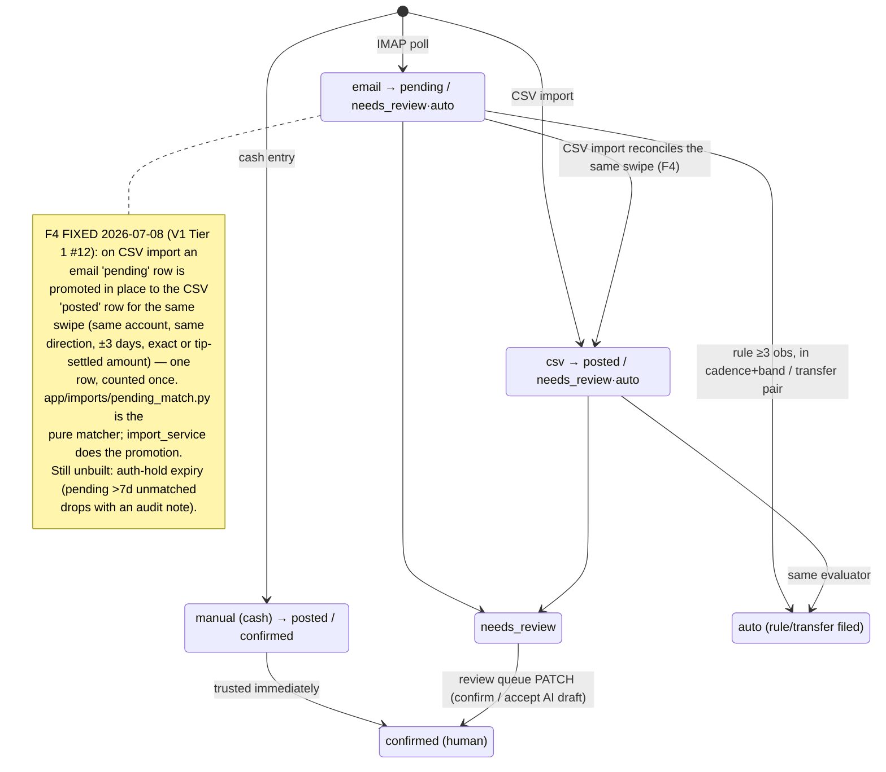
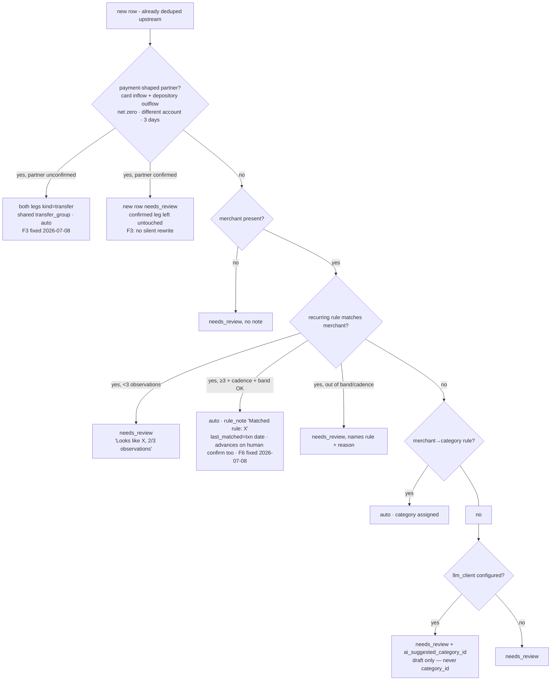
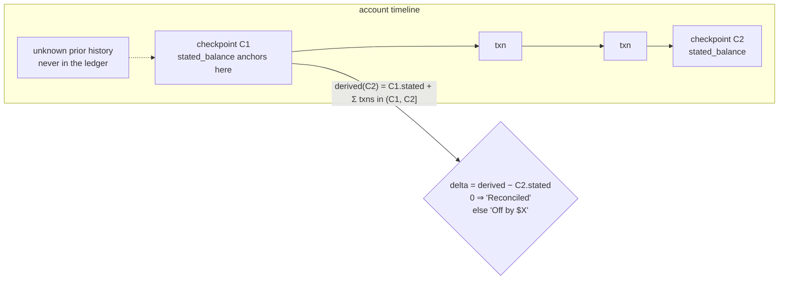
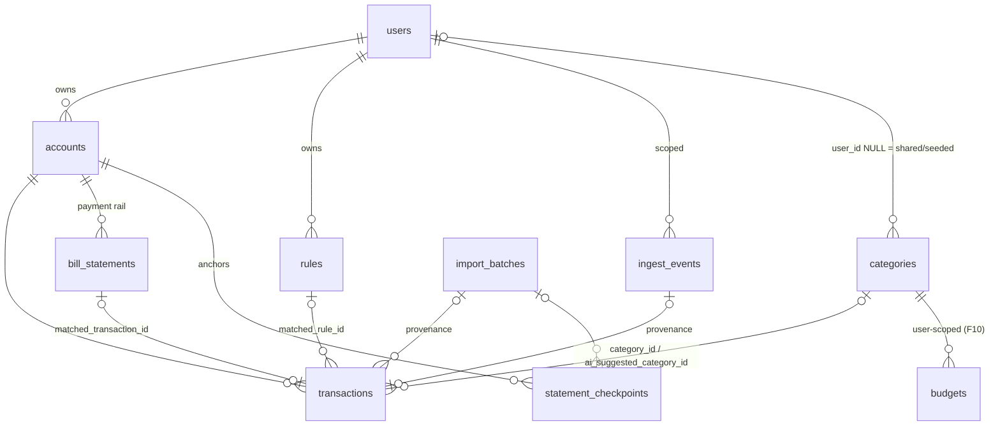

# ARCHITECTURE.md — Magpie (software-level)

> **Status (2026-07-09): v1 feature-complete through V1.md's tiers and live** at
> `https://dragonfly.tail2ce561.ts.net` (tailnet-only, SSO-only; CI → Release → Deploy green;
> the deployed `/version` tracks `main`). The 2026-07-05 deep-review findings F1–F18 are all
> closed (the last two, F13 and F15, on 2026-07-09). Server: SSO-only auth; the full data model
> (eleven tables incl. `alert_latches`); the pure `app/ledger/` + `app/rules/` correctness
> core; CSV reconciliation with per-institution sign conventions + multiplicity-aware dedupe;
> **live email ingestion** (Amex / US Bank / Discover parsers from the real corpus, main-account
> IMAP scoped to the `magpie-ingest` label — see "The ingestion pipeline"); the rules engine +
> review queue with corrections and rule-creation; bills + the cash-flow projection; user-scoped
> budgets; transaction splits; **four latched ntfy sweeps** with `magpie://` deep links; and the
> AI category-draft guardrail. Android: the full suite-parity app — bottom bar, hero, content
> Home, Transactions with server-backed filters/search/infinite scroll + split/recategorize/
> delete, onboarding, encrypted token store, ~28 light+dark Roborazzi baselines.
> **Remaining work is planned in [ROADMAP.md](ROADMAP.md)** (rewritten 2026-07-09 as the single
> forward roadmap; [V1.md](V1.md) is the closed tier-build record). **Known gaps, all
> deliberate, none silent:**
> 1. **The ledger has never held a real dollar.** One "Test" account exists; 22 real Amex
>    alerts sit `outcome=unparsed` awaiting the real accounts (and the F15 replay tool to
>    retro-file them). The 12-month CSV backfill, the Discover sign-convention confirmation,
>    the Visa in/out decision, and the statement-parity clock (the v1 acceptance gate) have
>    not started — ROADMAP.md Wave 0 is that critical path. The Visa is **out of v1** as
>    alerts stand (owner set up US Bank/Amex/Discover only). Exact alert senders:
>    `AmericanExpress@welcome.americanexpress.com`, `usbank@notifications.usbank.com`,
>    `discover@services.discover.com`.
> 2. **The production LLM is not yet enabled** (`llm_base_url` unset in the live server — the AI
>    stage silently skips), **but the client has now been live-probed** against the suite's
>    `google/gemma-4-e4b` (2026-07-09): it surfaced a real bug the fake-client tests hid (gemma
>    fences its JSON, which dropped every suggestion) — now fixed with fence-tolerant extraction —
>    and confirmed good draft quality (11/12, ~3.7 s/draft). Enabling it in prod is an owner-gated
>    compose-`environment:` change. **"First insights"** (plain-language summaries) were never
>    built at all (ROADMAP.md Wave 2).
> 3. **No `bill_issued` email parser** — Discover's statement-ready sender is still
>    unconfirmed (browser flakiness; don't guess); bills enter via `POST /bills` only.
>    The **parser-replay tool (F15) is built** (2026-07-09, `POST /ingest/replay`).
> 4. **Two sweeps unbuilt** — auth-hold expiry (the first data-*mutation* sweep) and
>    paycheck-*short* (band-based, at ingestion). **F13's bill-matching guards are built**
>    (2026-07-09): sign/kind pool filters + one-bill-per-transaction.
> 5. **Data visualization is now landing** (ROADMAP.md Wave 1, 2026-07-09) — the read models,
>    the Trends screen (`Sparkline`s: net trend + income/spend tiles + category bars), the Home
>    hero safe-to-spend `TickerNumber`, the Home month-tile sparklines, the Budgets
>    month-utilization `ProgressRing`, and the merchant drill-down all shipped. The offline read
>    cache (#12b) is the remaining Wave 1 infra item; Wave 2 (AI) is gated on the backfill.
> 6. **On-device verification batch owed `[H]`:** formal SSO sign-in confirmation,
>    split-sheet interaction, encrypted token store (F17), one real alert deep-link tap,
>    font-scale/TalkBack, and a human eyeball pass over the recorded baselines.
> 7. **Ops:** the uptime-kuma monitor is unverified; the smoke user's prod residue is
>    undocumented; host ROADMAP2's Magpie rows still need the planned→live update. (The
>    NAS-dump encryption gate and the smoke-token subject-email pin both closed 2026-07-08 —
>    the real-data gate is open.)
>
> Per the suite docs rule, convert each section to as-built language in the same PR that
> lands it. Suite-level context: `C:\Code\ARCHITECTURE.md`. Build spec + locked decisions:
> [CLAUDE.md](CLAUDE.md). Forward plan: [ROADMAP.md](ROADMAP.md).

Magpie is household cash-flow tracking with a review-not-enter product law: money events
arrive automatically (alert emails, monthly CSV), deterministic rules file the regular ones,
the local LLM drafts the rest, and the human sees a review queue and deviation alerts.

## System shape

```
Android (Kotlin/Compose) ⇄ Tailscale Serve (HTTPS, MagicDNS) ⇄ FastAPI :8005 ⇄ Postgres :5436
   phone must be on tailnet          │
   (ntfy precedent)                  ├→ IMAP (Gmail label "magpie-ingest") — in-process poller
                                     ├→ LM Studio :1234 (category drafts, insights)
                                     ├→ ntfy :8095 (topic magpie-alerts)
                                     └→ dragonfly-id JWKS (SSO verification, outbound HTTPS)
```

## Diagrams (added post-review 2026-07-05 — the two invariants the code review found broken, F1/F4, were exactly the un-diagrammed ones)

### Transaction lifecycle — status × review_state (the F4 trap made visible)



### Rule evaluation — the order every new row goes through (built, Phase 5/7)



### Balance anchoring — the F1-correct semantics (as-built 2026-07-08; `derived_balance`/`reconciliation_delta`)



### Data model — eleven tables (migrations 0001–0004 + `c4e17a9b2d38` seed categories, `d5f2a1b3c4e6` alert latches, `e7c1a9d4f0b2` budget user-scope, `f3b8c2e9a1d7` splits; `alert_latches` — user_id + alert_key + latch bit — not diagrammed)



## Deviations from the suite app pattern (all deliberate, all locked)

| Suite norm | Magpie | Why |
|---|---|---|
| Public hostname via Cloudflare tunnel | **Tailnet-only** (Tailscale Serve fronts loopback :8005) | Financial data gets zero internet attack surface; phone is already on the tailnet |
| Password auth + optional SSO | **SSO-only** (no register/login endpoints) | BROKER.md 2e pilot; smallest possible auth surface |
| Synthetic smoke registers a password account | Smoke mints a **suite token** | No password path exists |
| Request-driven server only | **In-process background poller** (FastAPI lifespan task for IMAP) | First app needing scheduled ingestion; one container beats a worker sidecar at this scale |
| — | **Read-only invariant**: nothing on this box can move money | The security identity of the app |

Everything else follows Cookbook: compose layout (minus cloudflared), Alembic
migrate-on-boot, `/health` + `/version`, slowapi, pydantic-settings, NullPool test conftest,
Pulse composite build, suite signing/release/deploy conventions.

## Server design (`server/`)

### The two pure domain packages (the correctness core — no I/O, table-driven tests)

- **`app/ledger/`** (built, Phase 2–3) — `classify.py` (sign-convention enforcement: spend < 0,
  income/refund > 0, transfer-pair zero-sum invariant) + `rollups.py` (monthly income/spend/net,
  transfers excluded, refunds netted into spend not income) + `balances.py` (**Phase 3, F1
  fix 2026-07-08** — an account's OWN balance, deliberately distinct from the household rollup:
  it includes every transfer leg, since money genuinely moved through that specific account.
  `derived_balance` anchors at the earliest `statement_checkpoint`'s stated balance and adds
  only transactions dated after it — prior history the ledger never saw is already inside that
  stated balance, so it can't be summed twice; `reconciliation_delta` is the ledger-vs-statement
  honesty meter, checking whether the ledger accounts for all movement between the earliest and
  latest checkpoints. Anchoring is what makes the statement-parity gate reachable after a
  backfill). 34 table-driven tests total, plus `rollup_by_category` (per-category actuals for
  budgets — user-scoped per F10 — and the natural feed for ROADMAP.md Wave 1's read models).
  If a number on the phone is wrong, the bug is here or in what
  feeds it — the `nutrition/` / `lists/merge.py` precedent.
- **`app/imports/csv_parser.py`** (built, Phase 3) — pure, no DB: auto-detects Date/
  Description/Amount-or-Debit+Credit/Balance columns from common header aliases (deliberately
  generic rather than per-issuer). Handles `$1,234.56`, parenthetical-negative `(12.34)`,
  and six date formats. 28 tests. **`app/imports/institution_mappings.py` (F5, 2026-07-08)**
  reconciles the file's sign convention with the ledger's (negative = outflow): `resolve_sign_flip
  (institution, override)` — `import_csv` flips every row's sign when the institution default
  (Amex/Discover = positive-is-charge) or an explicit per-import override says so, *before* the
  sign→kind derivation. Without it a card backfill would book every charge as income. **Discover
  confirmed 2026-07-09** against a real 24-month export (positive charge, "INTERNET PAYMENT -
  THANK YOU" negative) and added; its CSV also needed two parser fixes — `csv_parser`'s date
  aliases gained `"trans. date"`/`"post date"` (Discover's two date columns, period and all —
  neither matched before, so its import failed outright with "No recognizable date column").
  **`default_kind_for(account_type, amount, description)` (2026-07-09, from the real Amex
  backfill):** sign alone is wrong for a card — a credit card never receives *income*, so a
  positive (balance-reducing) amount is a **payment** (transfer, if the description matches
  `looks_like_card_payment` — "MOBILE PAYMENT - THANK YOU", AUTOPAY, …) or a **refund**, never
  income. `import_csv` uses this instead of the naive `amount>0 ⇒ income`. Proven on the real
  18-month Amex corpus (2633 rows): it books $0 income (the old logic would have booked ~$208k —
  17 card payments + 49 refunds miscounted), spend −$198k net of refunds, transfers excluded.
  Depository accounts keep the plain income/spend convention (a checking deposit *is* income);
  the checking-side leg of a card payment is refined by cross-account transfer pairing.
  **Internal transfers (2026-07-09, from the real US Bank export):** a checking↔savings move
  ("MOBILE BANKING TRANSFER …") is neither income nor spend, but depository↔depository can't
  auto-pair (the F3 payment-shape guard is card+depository by design), so `looks_like_internal_transfer`
  books both legs as `transfer` by description. Validated on a real 4-account overlap month (Amex +
  Discover + Checking + Savings): the Amex/Discover payments pair to zero cross-account, paychecks
  book as income, internal transfers are excluded (removed $18k of phantom income). Judgment-call
  outflows (an investment buy, payments to *untracked* cards) stay spend — the owner recategorizes.
- **`app/rules/`** (built, Phase 5) — `clock.py` (the injected time seam — `SystemClock` in
  production, `FixedClock` in tests, so cadence/band logic gets real time-travel tests)
  + `recurrence.py` (cadence windows — weekly/biweekly/monthly ± `slack_days`, monthly
  clamps to the last valid day so Jan 31 → Feb 28 doesn't crash) + `bands.py` (rolling
  median ± pct tolerance, compared on magnitude so a $45 bill and a refund-shaped -$45 read
  the same) + `merchant_match.py` (**F8 fixed 2026-07-08** — normalization strips card-network
  noise like `SQ *` / trailing transaction IDs, but the prefix now requires a real separator so
  it no longer chews mid-word — SPOTIFY/POSTAL/POSTMATES survive; and matching is now *one-way*
  containment: the rule pattern must appear within the observed merchant, so a broad rule
  ("AMAZON") matches a specific merchant ("AMAZON PRIME") but the specific "AMAZON PRIME" rule
  no longer mis-fires on a plain "AMAZON" purchase. **Bank-prefix strip (2026-07-09, from the
  real US Bank data):** normalization also strips statement transaction-type wrappers —
  `WEB AUTHORIZED PMT`, `ELECTRONIC WITHDRAWAL/DEPOSIT`, `RECURRING DEBIT PURCHASE`,
  `DEBIT PURCHASE [-VISA]`, `ZELLE INSTANT PMT FROM/TO` — so `merchant_norm` is the clean payee
  ("ROCKET MORTGAGE", not "WEB AUTHORIZED PMT ROCKET MORTGAGE"), which the Android screens now
  display (they switched from `merchant_raw` to `merchant_norm ?: merchant_raw`), the AI reads,
  and `/summary/merchants` groups by — merging a payee across transaction types. `merchant_raw`
  stays the untouched original for provenance/search) + `transfer_matching.py`
  (**F3 fixed 2026-07-08** — pairs only a *payment-shaped* pair: the `card` leg is the
  positive inflow, the `depository` leg the negative outflow, net zero, different account,
  within a day window. Requiring the card-payment shape — not merely two ±equal amounts —
  stops a card spend and a coincidental same-amount deposit from fusing into a bogus transfer;
  non-card internal moves fall through to review. The confirmed-partner guard and the un-pair
  path live in the transaction service). All pure, 23 table-driven tests. Deviation detection
  runs on these primitives in the latched sweep loop (see "Alert latching" below);
  paycheck-*short* is the one deviation not yet detected anywhere (ROADMAP.md Wave 0).

### The ingestion pipeline (`app/ingest/`)

```
Gmail filter (main account) → label "magpie-ingest" → IMAP poll of that label (lifespan task)
  → per-issuer parser (Amex / US Bank / Discover, by exact sender — Visa out of v1)
  → dedupe (message-id + payload hash → ingest_events)
  → account resolved by last4 hint → transaction row (status=pending, needs_review)
      (date = parser's date, else the receipt timestamp in owner-local tz — F18, `app/time_util.py`)
  → no matching account, or no recognized template → outcome="unparsed"
CSV/OFX import (monthly) → institution mapping → reconciles against email-sourced pending
  rows first (F4: promote the pending swipe to posted in place), else creates a new posted row
Manual entry (cash only) → same pipeline tail
```

**Testability seams (architectural):** four injected dependencies, each one interface with
a fake, all built — the **clock** (`rules/` and all sweeps take `now`; every recurrence/
expiry/freshness test is a time-travel test), **the IMAP fetcher** (see below), the LLM
client, and the ntfy publisher (alert tests assert **latching**: one publish per condition
episode, not per sweep — persisted, F11). Nothing in the pipeline reads a wall clock or
opens a socket directly.

**Built (Phase 1):** the suite-token test helper — `tests/conftest.py` generates one local RSA
keypair per test session and stubs the JWKS fetch, so tests mint valid RS256 suite tokens
without a real dragonfly-id (the only way to get an authenticated test client at all, since
Magpie has no password login). **Gotcha discovered building it:** `tests/` has no
`__init__.py`, so pytest's own conftest auto-discovery and a test file's
`from tests.conftest import suite_token` load **two separate module instances**, each running
the module-level keygen once — a token signed via one and verified via the other's JWKS fails
100% of the time. Fixed by exposing the helper as a fixture (`make_suite_token`) rather than an
importable function; fixtures always resolve through pytest's single cached module. Future test
files should request the fixture, not import the function.

**Built (Phase 4, extended 2026-07-08):** `app/ingest/parsers.py` — pure, no I/O — dispatches by
exact sender to three issuer parsers:
- **Amex** — "Large Purchase Approved" (spend) / "Merchant credit/refund was issued" (refund).
- **US Bank** — the account-wide "Your transaction is complete." alert (**"transaction of"** = debit→spend,
  **"deposit of"** = money in→income, i.e. the paycheck path; no merchant, filled by CSV) **plus** the
  Zelle alert. **F7:** Zelle *direction* is read from the body — received→income, "you sent"→spend,
  ambiguous→`UnparsedEmail` rather than assumed income. `parse_version` `3` (was `2` for F7).
- **Discover** — "Transaction Alert" (a card charge → spend; pending pre-auth, reconciled to the
  posted amount by CSV). Clean labeled fields (`Amount:`/`Merchant:`/`Date:`/`Last 4 #:`) parsed
  precisely so the `$1 authorization` boilerplate can't be mistaken for the amount.

Each extracts amount, merchant, date, and a last4 hint via regex against the real corpus's
structure; anything else — an
unrecognized subject, a recognized subject with no dollar figure, or a resolved parse with no
matching account — raises `UnparsedEmail` and becomes an `outcome="unparsed"` `ingest_event`,
never a crash and never silent data loss. **F16 (fixed 2026-07-08):** account resolution by
last4 now degrades to unparsed when two accounts share a last4 (a card and a checking account,
say) instead of raising `MultipleResultsFound` and aborting the whole poll batch.
**Inactive accounts never match (2026-07-09):** a reissued card keeps the account but changes
its last4, and the CSV export lands on the *current* card — so an alert filed to the retired
account could never reconcile against it, and the eventual CSV row would double-count the
charge. Deactivating the old account routes its alerts to the unparsed operator view, which is
where "an old card is still being charged" belongs. (Found live: one recurring GOOGLE charge
still alerting on a replaced Amex.)
**Two real bugs the tests caught before deploy:** the amount regex originally matched the
*first* dollar figure in an Amex body, which is the alert-threshold sentence ("...was more
than $1.00"), not the real charge that appears later — fixed to anchor on the *last* match.
And the merchant-extraction word-walk broke on a trailing hyphen a signed amount leaves behind
("...ONLINE -$18.00"), silently falling back to the entire flattened sentence — fixed by
stripping trailing separator punctuation first.

`app/ingest/imap_client.py` is the injected IMAP-fetcher seam: `RealImapFetcher` issues
`BODY.PEEK[]` (never plain `BODY[]`), so polling never sets the `\Seen` flag — the mailbox
stays read-only *by construction*, not just by convention (CLAUDE.md §8). Since flags are
never touched, "already processed" is tracked entirely by `ingest_events.message_id`, and
every poll re-scans a rolling window. `FakeImapFetcher` is the test double; `tests/fixtures/
*.eml` are sanitized (fabricated amounts/merchants/last4s) but structurally real, and
`test_ingest_service.py` feeds them through the actual parsers and a real throwaway DB — the
mock-the-seam E2E pattern, with only the socket faked. `app/ingest/poller.py` is the lifespan
background task (wired in `app/main.py`); it only starts if `imap_host` is configured, the
same "absence disables the feature" pattern as `suite_jwks_url`. `GET /ingest/events` is the
unparsed-backlog operator view; `POST /ingest/poll` triggers an out-of-band poll for
verification without waiting out the interval.

**Pending→posted matching against CSV truth is built (F4, 2026-07-08):** on CSV import an
email-sourced pending row and the CSV-imported posted row for the same swipe merge into one
reconciled row (`app/imports/pending_match.py` is the pure matcher — same account, same
direction, ±3 days, exact or tip-settled amount; `import_service.py` promotes the pending row
in place, keeping its email provenance and any human/rule decision). This closes the F4
double-count. **Not built yet, called out rather than silently skipped:** the
auth-hold-expiry sweep (the freshness and unparsed-backlog sweeps are built and latched —
see "Alert latching"). **The live proof happened
2026-07-08:** the first real poll connected to Gmail and parsed 22 real Amex alerts
(`parser=amex`); they sit `outcome=unparsed` pending the owner's real accounts
(ROADMAP.md Wave 0 #1), which the replay tool below then retro-files.

**Parser replay is built (F15, 2026-07-09) — `app/services/replay_service.py`,
`POST /ingest/replay`.** Because every email is kept whole in `ingest_events.raw_payload`
with the `parse_version` that read it, a parser fix (or, in the 22-Amex case, a *newly created
account*) can be replayed over history: the endpoint re-parses the `unparsed` backlog with
today's parsers and files what now fits, through the same `evaluate_transaction` path a live
poll uses — so a retro-filed alert lands identically to one caught live (`imap_client.
message_parts()` is shared by both, so replay parses byte-identical inputs). Four properties
make it safe to point at real money:

- **`dry_run=true` is the default** — it runs the identical code path and rolls the
  transaction back, so the report describes what a real run *would* do because it did it.
- **Idempotent**: a filed event leaves the `unparsed` backlog, and an event that already has a
  transaction is skipped outright. Replaying twice files once.
- **Never double-counts the backfill.** A replayed alert can predate the CSV import that
  already posted its swipe (the 22 Amex alerts sit inside the 18-month Amex import), so each
  candidate is checked against posted rows via `pending_match.find_posted_duplicate()` — the
  *inverse* of the F4 matcher, sharing its one "same swipe" tolerance definition. A match
  records the event as `duplicate` instead of filing a second, pending copy.
- **Scoped to `unparsed`.** Re-parsing a `created` event would mutate live financial history;
  that belongs behind its own review surface (ROADMAP Wave 3 #25), not a bulk button.

Each event comes back with an operator-readable `action` + `reason` ("Parsed by amex, but no
unique account matches last4 0000"), because explaining why history did or didn't move is the
tool's whole value.

Design rules: parsers are one module per issuer with **committed sanitized `.eml` fixtures**
(public repo — nothing real in git); an email that parses to nothing becomes an `unparsed`
ingest_event surfaced in an operator view (+ ntfy on backlog growth, once Phase 6 lands ntfy)
because a silently broken parser is the pipeline's worst failure mode (the ledger quietly
goes stale); the ingest code never mutates the mailbox (read-only by behavior, enforced via
`BODY.PEEK[]`, not just documented); every transaction carries provenance (`source` +
`ingest_event_id`) so any number is traceable to the email that produced it.

### Rules evaluation order (deterministic first, AI last — always)

**Built (Phase 5), wired into both `import_service.py` and `ingest_service.py` so every
CSV row and every ingested email goes through the same evaluator — `app/services
/rule_service.py::evaluate_transaction`:** 1. dedupe (already done upstream by each caller
before a row ever reaches the evaluator) → 2. transfer matching (a payment-shaped pair —
card inflow + depository outflow netting to zero on different accounts, F3 — ⇒ both legs
`kind="transfer"`, `review_state="auto"`, no review; a *confirmed* would-be partner is left
untouched and the new row routes to review instead) →
3. recurring income/bill rules (≥3 observations + within cadence window + within amount band
⇒ auto-filed with `rule_note` = `"Matched rule: X"`; below threshold or out of band ⇒
`needs_review` with an explanation naming the rule and the reason). **F6 (fixed 2026-07-08):**
the rule's `last_matched_at` is anchored to the matched transaction's *date* (not wall-clock
`now`), and confirming a rule-flagged row in the review queue advances the rule's window too —
so a single missed/out-of-band occurrence the human corrects no longer derails the rule
forever. → 4. merchant→category
rules (deterministic category assignment ⇒ auto) → 5. **(built, Phase 7)** if `llm_client`
is supplied and nothing above matched, the LLM proposes a category —
`app/services/ai/categorize.py::suggest_category` writes the result to
`ai_suggested_category_id` **only**, never `category_id`, and `review_state` stays
`needs_review` regardless: accepting a draft is the review queue's "Accept AI suggestion"
action (a human `PATCH`, CLAUDE.md §6's "nothing the model produces is persisted without
explicit confirmation" made literal). Falling through with no `llm_client` configured (the
production default today — see the status header) behaves exactly as before Phase 7: plain
`needs_review`, no draft. **A rule only ever decides *category*, never *kind*** — the
amount's sign is the single source of truth for spend/income/refund
(`app/ledger/classify.py`), so a mismatched rule can never force an
invalid sign combination onto a transaction.

**Cold start:** no rule auto-files until ≥3 observations, counted from *every* matching
transaction on that account regardless of whether it predates the rule — Phase 3's CSV
backfill history counts the same as live events, exactly as CLAUDE.md's cold-start bar
intends. Below threshold, the review queue shows *why* ("Looks like XCEL ENERGY, 2/3
observations"), not just that it needs a look. **F14:** that observation lookup prefilters the
merchant substring in SQL (`merchant_norm ILIKE %matcher%`, both stored already-normalized)
instead of loading + Python-normalizing the whole account table per evaluated row; the exact
one-way `matches()` stays the Python authority. `GET /transactions` also gains opt-in `limit`
(≤500)/`offset` (default unbounded — review queue unchanged). **Tier 4 #32 (2026-07-09):** it
further gains `account_id` and `q` (case-insensitive merchant search over `merchant_raw`/
`merchant_norm`), so the Android Transactions screen's filter chips + search box translate to
server queries that stay correct under offset pagination (the infinite-scroll client now consumes
`limit`/`offset`).

**The AI guardrail (built, Phase 7):** `app/services/ai/llm_client.py` is the fourth and
final injected seam (clock, IMAP fetcher, ntfy publisher, now the LLM client) —
`FakeLlmClient` for tests, `LmStudioClient` for a real local (never hosted) OpenAI-compatible
endpoint. `app/services/ai/categorize.py::suggest_category` enforces the vocabulary
guardrail directly: the prompt lists only the user's own category names, the response is
Pydantic-validated, and a category the model invents outside that list is silently
rejected — `None`, never a guessed fallback. The prompt sees only DB-derived transaction
facts (merchant, amount, kind) and the category vocabulary, never a raw email. Guardrail
tests (`test_ai_categorize.py`) pin all four failure modes (malformed JSON, missing field,
out-of-vocabulary answer, zero categories available never even calling the model) plus a
happy path — all against `FakeLlmClient`, exactly CLAUDE.md's "IMAP + LM Studio + ntfy
always mocked in CI" rule. **Live-probe fix (2026-07-09):** exercising the real
`LmStudioClient` against the suite's `google/gemma-4-e4b` revealed the model wraps its JSON in a
```json … ``` markdown fence even when told "only JSON", so `model_validate_json` rejected
*every* real suggestion while the clean-JSON fake stayed green. `suggest_category` now runs the
reply through `_extract_json_object` (strip a code fence, else take the outermost `{...}` span)
before validation; three regression tests reproduce the real reply shape (fenced, prose-wrapped,
clean). This is why the fake must mimic the *real* reply shape, not an idealized one. **Enabled
for prod (2026-07-09):** `LLM_BASE_URL` (`http://host.docker.internal:1234` — the client appends
`/v1/chat/completions`) + `LLM_MODEL` (`google/gemma-4-e4b`) are pinned in the compose
`environment:` block (invariant #4), so the stage turns on as soon as the server is deployed with
this branch's code. Going-live hardening: `suggest_category` now catches *any* client exception
(unreachable/slow model, HTTP error, malformed reply) → returns no draft rather than propagating,
because the `rule_service` call site doesn't guard it and a model hiccup must never break the poll
loop (the AI is best-effort on top of the deterministic pipeline). **Not yet live:** the running
prod container is `main`'s image (no fence fix), so the config is inert there until this branch
deploys.

**Bill matching (built, Phase 6):** `app/rules/bill_matching.py` — pure — pairs a
`BillStatement` to the closest-dated payment on its bound account (CLAUDE.md §2: each
biller rides one payment rail) within a 10-day window either side of the due date, exact
amount only; `is_bill_missing` answers the time question (due date + a 3-day grace passed,
still unmatched) that `app/services/bill_service.py` combines with "no match yet" to decide
`is_missing`. `POST /bills` tries an immediate match (a backfilled historical bill
shouldn't sit "missing" forever) and `POST /bills/{id}/rematch` re-checks after a later
import/poll brings in the settling payment.

**F13's two guards (built 2026-07-09)** — both protect the same failure: a bill that looks
quietly settled never fires its missing-bill alert, which is strictly worse than one that
looks unpaid.

1. **Direction.** The matcher compared `abs(amount)` alone, so a same-magnitude *deposit*
   landing near the due date "paid" the bill. A payment must now be an outflow
   (`amount_cents < 0`) of a payment-shaped `kind` (`spend` or `transfer` — a card statement
   paid from checking is a transfer leg, CLAUDE.md §2; `income` and `refund` are inflows).
2. **One bill per transaction.** Two same-amount bills on one rail could both point at the
   single payment that settled only one of them. `bill_service._find_payment` excludes
   transactions already claimed by another bill, and a **partial unique index** on
   `bill_statements.matched_transaction_id` (migration `a1d4c7e2b905`, `WHERE … IS NOT NULL`
   so unmatched bills may repeat) is the durable backstop for any future caller.

`_find_payment` also narrows the candidate pool in SQL — account, date window, sign, kind,
unclaimed, non-split — rather than loading every transaction on the account into Python, so a
backfilled account with thousands of rows stays cheap (F14 discipline). Note the SQL trap it
documents: `NOT IN (subquery)` returns nothing at all if the subquery yields a single NULL,
so the `IS NOT NULL` filter inside it is load-bearing.

**Alert latching:** `app/rules/alerts.py::should_alert` — pure, fires only on the true rising
edge, stays silent while a condition persists, fires again if it resolves and recurs (CLAUDE.md's
"once per episode, not once per sweep"). **F11 (2026-07-08):** that "already alerted?" bit is now
**persisted data** — `app/services/alert_latch_service.latched_should_alert` reads/writes an
`alert_latches` row keyed per condition (migration `d5f2a1b3c4e6`), so a redeploy no longer
re-pages a still-open condition (the old sweep held it in process memory and reset on every
container recreate). **`app/services/ntfy_client.py`** is the fourth injected seam
(`FakeNtfyPublisher` records, `HttpNtfyPublisher` POSTs). **Built + wired into the lifespan sweep
loop: four latched alerts** — unparsed-email backlog, **missing-bill** (an overdue unmatched
`BillStatement` past an owner-local due-date grace, F18 — the "a simulated missing bill pages the
phone" exit), **paycheck-late** (a `recurring_income` rule whose expected paycheck — cadence +
`last_matched_at` — is overdue past its slack; clears when F6 advances the rule on arrival), and
**per-account freshness** (an account with prior `ingest_events` activity but none in
`account_freshness_days`, so alert-decay is caught; no-history accounts skipped so nothing
false-alarms). Checked every `sweep_interval_minutes`; 12 time-travel tests in
`test_sweep_service.py`. **Tier 4 #34 (2026-07-09) — alert deep links:** each `publish()` now
carries a `click` (an ntfy `Click` header) with a `magpie://` deep link, so tapping the phone
notification opens the screen that lets the owner act — missing-bill→`magpie://bills`,
paycheck-late→`magpie://cashflow`, account-stale→`magpie://accounts`, unparsed-backlog→
`magpie://home`. The Android app registers the `magpie://` scheme and `MagpieNavHost` routes each
host; keep the two lists in sync. **Remaining:** **auth-hold expiry** (a data-*mutation* sweep —
drop stale pendings) and paycheck-*short* (band-based, better at ingestion). **Cash rule** (the ATM
withdrawal *is* the spend) is still target design, not built.

### Domain map

**Built (Phase 0–7):** `app/main.py` (`/health`, `/version`), `app/routers/suite_auth.py` +
`app/services/suite_auth.py` (suite login), `app/routers/auth.py` (`POST /auth/refresh` — a
Phase 1 gap: refresh tokens were minted but nothing could redeem them until this landed),
`app/security.py` (local HS256 session tokens). Full CRUD for accounts, categories, and
transactions (`app/routers/{accounts,categories,transactions}.py` +
`app/services/{account,category,transaction}_service.py`), all scoped to `CurrentUser` by
filtering on `user_id` in the query itself (never a separate ownership check — a cross-user
`test_*_not_visible_to_a_different_user` test pins this per domain). The **shared category
vocabulary** (Groceries/Dining/Transport/Utilities/Housing/Subscriptions/Entertainment/
Health/Shopping/Travel/Cash/Income/Other) is seeded with `user_id NULL` by migration
`c4e17a9b2d38` (V1.md Tier 1 #8) so a fresh user — and the AI stage — has a vocabulary from
first boot; `list_categories` returns the shared set plus the user's own. Category CRUD is
full — `POST` (create), `PATCH /categories/{id}` (rename, 2026-07-08), `DELETE` — with seeded
rows read-only: both the rename and delete routes scope by `user_id`, so a shared category
404s either way (the ownership filter is the read-only guard). `GET /transactions/summary`
is the Home month-panel read, backed by `app/ledger/rollups.py`; `AccountOut` now carries
computed `balance_cents`/`balance_delta_cents` (`app/ledger/balances.py`). `POST /imports/csv`
(`app/routers/imports.py` + `app/services/import_service.py`) parses via `csv_parser.py`,
dedupes against existing transactions by an (account, date, amount, description) fingerprint
**by multiplicity, not existence (F9)** — it counts how many of each fingerprint already exist and
lets each file row consume one, so two genuinely distinct same-day duplicates both survive and
re-import stays idempotent (the old boolean check skipped the second, and crashed on re-import once
two identical rows existed) — creates `needs_review` transactions
(kind guessed from sign only — a CSV row is never a manual confirmation), and optionally a
`StatementCheckpoint` when a Balance column is present. `POST /ingest/poll` + `GET
/ingest/events` (`app/routers/ingest.py` + `app/services/ingest_service.py`) are the email
pipeline's manual-trigger and operator-view surface. All ten §4 tables exist as SQLAlchemy
models; migration `0002` (Phase 4) added `ingest_events.raw_payload` (the actual body, not
just its hash — needed so a fixed parser can replay history, which the Phase 1 migration's
comment promised but the columns didn't yet back) plus `account_id`/`user_id` for scoping.
Migration `0003` (Phase 5) added `rules.user_id` (the same CurrentUser-scoping gap
`ingest_events` had before Phase 4, caught the same way) plus `transactions
.matched_rule_id`/`rule_note` — the review queue's "why", captured as a fact at evaluation
time rather than re-derived later from whatever the rule looks like now. `GET/POST /rules`,
`GET/PATCH/DELETE /rules/{id}` (`app/routers/rules.py` + `app/services/rule_service.py`) are
plain CurrentUser-scoped CRUD; `PATCH /transactions/{id}` gained `review_state` and `kind`
(the review queue's confirm/correct action — `kind` only re-validates the sign invariant
when supplied, never blindly trusted; and changing a transfer leg's kind away from
`"transfer"` now dissolves the whole `transfer_group` so no dangling half-group is left, F12);
`POST /transactions/{id}/unpair` dissolves a transfer pair explicitly (both legs revert to
their sign-based kind and return to review, F12); `GET /transactions?review_state=needs_review`
is the review queue's read. **Transaction splits (Tier 3 #26, 2026-07-08, migration
`f3b8c2e9a1d7`):** `POST /transactions/{id}/split` (parts must sum to the amount, ≥2, sign-valid,
not a transfer/already-split) creates child allocations (`split_parent_id` set) and marks the
parent `is_split`; `DELETE …/split` reverses it. No double-count by construction — the parent stays
the ledger row (balance/list/month totals filter `split_parent_id IS NULL`) while the parts carry
the category breakdown (budget rollup filters `NOT is_split`); 7 tests pin that month total +
balance are unchanged by a split while budget actuals move to the parts. **The split *UI* landed
2026-07-09** (Tier 4 #32): the Transactions screen opens `ui/transactions/SplitSheet.kt` — a
`ModalBottomSheet` wrapping a pure `SplitSheetContent` allocator (parts of category + amount, live
remaining, Split enabled only when the parts sum to the total) → `POST /transactions/{id}/split`;
`is_split` was added to the Android `TransactionOut`, split parents show a "Split" tag and aren't
re-splittable. The interactive allocation still needs an on-device pass (Roborazzi covers layout only). `GET/POST /bills`, `POST /bills/{id}/rematch` (`app/routers/bills.py` +
`app/services/bill_service.py`) — no migration needed: `BillStatement.account_id` is
required, so it scopes via the same join-to-`Account.user_id` pattern Phase 3's
`StatementCheckpoint` already established, no nullable-join gap to close. `is_missing` is
computed at read time (`_to_out()`, mirroring `AccountOut`'s balance fields from Phase 3),
never stored. `GET/POST /budgets` (`app/routers/budgets.py` + `app/services/budget_service
.py`) — **`Budget` gained `user_id` (F10, migration `e7c1a9d4f0b2`, 2026-07-08)** when the Budgets
screen landed: before it, `list_budgets(month)` returned *every* user's rows for the month (the
smoke client's throwaway user is a real second user in prod), so the screen would have leaked
cross-user budgets. The column is nullable/additive (safe against pre-scoping orphans, which then
match no user); `create_budget` sets it and `list_budgets(user_id, month)` filters it, with a
cross-user scoping test. `actual_cents` is computed at read time via the new
`app/ledger/rollups.py::rollup_by_category` across every one of the user's accounts for
that category+month. Migration `0004` (Phase 7) added `transactions
.ai_suggested_category_id` — a draft, never a confirmed fact, kept structurally separate
from `category_id` so an AI suggestion can never be mistaken for a human/rule decision.
`GET /cashflow` (`app/routers/cashflow.py` → `cashflow_service` → pure `app/rules/cashflow.py`,
Tier 3 #23, 2026-07-08) is the "due before next paycheck" projection: the next paycheck (soonest
`expected_next_date` across recurring-income rules) + the account's unmatched upcoming bills, each
flagged `is_overdue`/`before_next_paycheck`. Consumed by the Android `ui/cashflow/` screen (see the
Android section).

**Read models (ROADMAP.md Wave 1, 2026-07-09):** `app/routers/summary.py` +
`app/services/summary_service.py` expose four read-only analytics aggregations for the chart
surfaces, all under one `/summary` prefix (kept off `/categories`/`/merchants` to avoid
route collisions): `GET /summary/history?months=N` (last N calendar months of income/spend/net,
oldest first — pure `app/ledger/rollups.py::rollup_month_series`, zeros for empty months so a
chart never gaps), `GET /summary/categories?month=` (net spend per category, largest first —
`rollup_by_category` joined with names, was only reachable through budget actuals),
`GET /summary/merchants?month=&category_id=&limit=` (top merchants, aggregated in SQL — never
loads a backfill month into Python, F14 discipline — grouped by `coalesce(merchant_norm,
merchant_raw)` so ingested and manual rows both participate), and `GET /summary/safe-to-spend`
(the genre's headline number — depository balances minus bills due before the next paycheck,
*composed* from the existing account-balance + cashflow services, cards excluded). 9 tests
(`test_summary.py`), pure series math table-driven. The Android chart screens that consume
these are Wave 1 #13–#16, still to build.

**Phase 8 (suite membership + release + operational fit) is built and verified** — see
"Operational fit" below. The one Phase-7 scope item never built is **"first insights"**
(plain-language summaries — only category-suggestion drafts exist); it is planned as
ROADMAP.md Wave 2, alongside the read-model endpoints (`/summary/history`,
`/categories/summary`, `/merchants/top`) that Wave 1's charts need.

## Android design (`android/`, package `com.magpie`)

Suite MVVM (Room + Retrofit + Hilt), Pulse composite build, **teal accent**
(`PulseAccent.Teal` — added to the library in Phase 0). Channel semantics (`MagpieTheme.kt`):
teal = money/primary, green = income/under-budget, amber = needs-review, a red channel built
locally from Pulse's proven `PulseRed`/`PulseRedDeep` (not a new library accent) =
over-budget/deviation.

**Design parity (the 2026-07-05 review's findings, closed by the Tier 4 pass 2026-07-08/09):**
the hero greeting panel (`MagpieTheme.heroGradient`, previously used by no screen, now leads
Home with a live status sentence), the suite bottom nav shell (`MagpieBottomBar`, mirrors
Cookbook's), content on Home instead of links (review-count + next-bill `PanelCard`s), dense
stat tiles that fit their money values (+ an `AutoFitValue` large-font guard), designed
empty/error states (`EmptyState` on every screen), refresh-on-resume, and onboarding. **Color
grammar** was corrected per the review's binding rules: ordinary spend + normal balances are
neutral (red strictly for over-budget/out-of-band/missing), Bills colors the status word
never the amount; green = income/under-budget/reconciled and amber = needs-review stay.
**Remaining from that review (ROADMAP.md Wave 0):** AI-suggestion text still borrows teal —
it gets its own violet voice, and teal pares back to brand/primary + money-totals.
**Data visualization (ROADMAP.md Wave 1) began 2026-07-09** with the **Trends screen**
(`ui/trends/`): a net headline over a filled 6-month `Sparkline`, an Income/Spend dense-`StatTile`
row (each with its own sparkline — income green, spend neutral per #31), the month's category
breakdown as proportional bars, and top merchants — consuming the new `/summary/*` read models,
reached from Home as a secondary link, light+dark Roborazzi baselines. **The Home hero** now
leads with a rolling safe-to-spend `TickerNumber` (`GET /summary/safe-to-spend`, best-effort;
the hero taps through to the cash-flow calendar), and **Budgets** tops its list with a
month-utilization `ProgressRing` (total spent/budget, red only when the household is over — #31),
and **the Home month tiles** (Income/Spend/Net) each carry a 6-month `Sparkline` under the value.
**The merchant drill-down** (`ui/merchant/`) is reached by tapping a merchant in Trends — a summary
card (total/count/average) over the merchant's transactions, loaded via the existing `q` search.
All Pulse components, matching the idioms the siblings actually ship (Plate's ring+ticker+sparkline,
Spotter's filled-line stat tiles) rather than inventing a bespoke Canvas.

**Built (Phase 2):** `data/remote/` — `ApiService` (Retrofit + kotlinx-serialization),
`AuthInterceptor` + `TokenRefreshAuthenticator` (mirrors Spotter/Cookbook's hardened
authenticator: serialized refreshes, only an explicit auth rejection signs out, a transient
network failure mid-refresh keeps the session), `SuiteAuthManager` (AppAuth PKCE — see the open
item below). `data/local/db/` — `PendingCashEntryEntity` + `CashEntryDao` (Room, the offline
cash-entry queue only — no broader read cache yet). `data/repository/TransactionRepository` —
the write-through: tries the server immediately, catches only `IOException` (genuine offline)
to queue locally, lets any HTTP error propagate as a real bug rather than a silent queue (5
repository tests against fakes pin this distinction, the `nutrition`/`merge.py`-style
correctness core on the client side). `util/NetworkSyncObserver` drains the queue on
reconnect (Cookbook's `NetworkSyncObserver` precedent).

Screens: `ui/signin/SignInScreen` ("Sign in with Dragonfly," the only auth path) ·
`ui/home/HomeScreen` (month in/out/net panel via `HomeContent`, gates on having ≥1 account —
shows an inline create-account form instead of the summary when none exist, and now links to
Accounts, Review queue, Bills, and Settings) · `ui/transactions/TransactionsScreen` (list) ·
`ui/cashentry/CashEntryScreen` (the offline-capable manual entry form) ·
`ui/accounts/AccountsScreen` (**Phase 3** — lists accounts with computed balance + a
"Reconciled"/"Off by $X" delta line when a checkpoint exists; each row has an "Import CSV"
action opening a dialog: institution field, `ActivityResultContracts.GetContent()` file
picker, multipart upload via `ApiService.importCsv`) · `ui/reviewqueue/ReviewQueueScreen`
(**Phase 5, extended Phase 7** — `GET /transactions?review_state=needs_review`; each row
shows the amount, merchant, and `rule_note` when a rule fired but didn't clear the
auto-file bar — CLAUDE.md's "the review queue shows why" made literal on-screen. **Phase
7:** a row with `ai_suggested_category_id` instead renders "AI suggests: {category name}"
in a visually distinct color/label with its own "Accept AI suggestion" action, never the
plain "Confirm" button — the exact CLAUDE.md Phase 7 exit bar, "review queue shows AI
suggestions distinctly from rule hits." Category names are resolved client-side from `GET
/categories`, fetched alongside the queue. **V1 Tier 1 #9 — the "correct" half of
approve/correct:** every row also carries a tonal "Correct" action opening a `ModalBottomSheet`
(the full category list + a kind selector for the rare sign-ambiguous case); tapping a category
confirms immediately, so the happy path stays one tap and a correction is at most two. All three
paths — accept-as-is, accept/pick a category, correct the kind — go through one
`ReviewQueueViewModel.confirm(id, categoryId?, kind?, ruleMatcher?)` → `PATCH /transactions/{id}`
(`review_state=confirmed`, null = leave untouched); a bad kind change surfaces the server's sign
re-validation error and leaves the row in the queue. **Tier 3 #22 "make this a rule" growth loop
(2026-07-08):** the sheet also carries an "Always file '<merchant>' this way" checkbox — ticking it
then picking a category passes a `ruleMatcher`, and `confirm` creates a `merchant_category` rule
(`POST /rules`, matcher = the txn merchant, server-normalized) *after* the confirm, so future
transactions from that merchant auto-file and skip the queue.) · `ui/bills/BillsScreen` (**Phase 6** — `GET
/bills`; each row shows the biller, due date, and a Paid/Missing/Awaiting-payment status
derived from `matched_transaction_id`/`is_missing`; the flat bills list, now the detail view
behind the calendar) · `ui/cashflow/CashflowScreen` (**Tier 3 #23, 2026-07-08** — the "due before
next paycheck" headline: a paycheck header from `GET /cashflow` (`next_paycheck_date` + total due
before it) over the upcoming bills split into "Due before next paycheck" / "After payday" sections,
each row colored by the corrected grammar — red only when overdue, amber for the before-payday set,
teal otherwise; linked from Home; light+dark Roborazzi baselines).
`ui/navigation/MagpieNavHost` gates the whole graph on `AuthGateViewModel.isSignedIn` (a
`TokenStore` Flow) — no explicit post-sign-in navigation call is needed, since saving a
session makes the Flow re-emit. **Tier 4 #27 (2026-07-08, mirrors `CookbookBottomBar`):** the
signed-in graph is wrapped in a `Scaffold` + `MagpieBottomBar` (`TopLevelDestination` = Home ·
Activity · Bills · Budgets · Settings; teal money-channel selection) shown only on top-level
routes, with Cookbook's `goTab` save/restore navigation; tab screens dropped their back buttons
while secondary screens (Accounts, Review queue, Cash flow, Rules, Cash entry) are pushed and keep
theirs. `ui/budgets/BudgetsScreen` (**Tier 3 #25, 2026-07-08** — the
month-vs-budget view: `GET /budgets?month=` for the current month with category names from `GET
/categories`, each row an actual-vs-budget `LinearProgressIndicator` with "$X left"/"Over by $X",
over-budget in the red channel and under in green; a FAB opens an add-budget dialog — category
picker + amount → `POST /budgets`; linked from Home; light+dark Roborazzi baselines).
`ui/rules/RulesScreen` (**Tier 3 #22, 2026-07-08** — the rules editor on the Phase-5 rules CRUD:
each rule shows its matcher, a human type label (Income/Bill/Transfer/Category rule) and a one-line
summary (cadence `kind ±Nd`, band `±N%`, `→ Category`, names from `GET /categories`), an
enable/disable `Switch` (optimistic → `PATCH /rules/{id}`, disabled rules drop to a muted channel),
and delete behind a confirm dialog (`DELETE /rules/{id}`); linked from Home; light+dark Roborazzi
baselines. The **"make this a rule" growth loop** landed 2026-07-08 in the review queue (below);
**deferred:** inline band/cadence editing). `ui/settings/SettingsScreen` (**V1 Tier 1 #10** — the category
editor: lists categories, the user's own (`shared=false`) get rename/delete affordances while
seeded/shared ones show a read-only "Shared" label (the server 404s a rename/delete of a shared
category), plus an "Add" action and an About block with the server `/version`. `SettingsViewModel`
wraps the existing `POST`/`PATCH`/`DELETE /categories` CRUD; the rules editor is deferred to Tier
3.) **Tier 4 #28/#29 (2026-07-08/09):** Home now leads with `MagpieHero` (the indigo→teal→green
gradient, a time-of-day greeting, and the status sentence "net this month · N to review · next
bill due") over live content cards — `ReviewQueueCard` (the count as a big amber datum → the
queue) and `UpcomingBillCard` (the soonest bill → the cash-flow calendar) — above the dense-tile
month panel; Accounts and Rules remain compact secondary links, and the FAB stays cash entry.

Each screen splits into a thin ViewModel-wired composable and a pure `*Content` composable
taking plain state + callbacks (`HomeScreen` → `HomeContent`, `AccountsScreen` →
`AccountsContent`) — the Roborazzi baselines screenshot the pure half directly, so no Hilt DI
is needed in the screenshot test. **A real layout bug was caught this way in Phase 2**: three
`StatTile`s in a `Row` without `weight()` silently overflowed off-frame — the recorded PNG
was the thing that surfaced it, not code review.

Offline model: the **only entry surface that's offline is cash entry** (the Room queue above);
everything else is online-first against the tailnet — no broader read cache yet (unlike
Cookbook's recipe cache). Acceptable because the phone is on Tailscale wherever it has signal.
Because Tailscale Serve provides HTTPS, the manifest needs **no cleartext exception** (unlike
Hawksnest's bare-IP problem).

### Resolved: the `magpie` suite OAuth client (registered 2026-07-05)

`SuiteAuthManager` uses client id `magpie`, redirect `com.magpie:/oauth2redirect`, and the
client is registered on dragonfly-id (see "Operational fit"). The formal on-device
confirmation of the full sign-in flow is still owed (`[H]`, ROADMAP.md Wave 0) — though the
owner's real-device use of released builds implies it works.

## Trust boundaries

1. **Internet → Magpie: none.** No public DNS, no tunnel. Reachability = tailnet membership.
2. **Mailbox → Magpie:** a main-account Gmail app password in `server/.env`, scoped by
   behavior to the `magpie-ingest` label (`BODY.PEEK` only — never marks/moves/deletes/sends;
   the label-only-forwarding design fell to Gmail's anti-automation wall, CLAUDE.md §8);
   parser output is untrusted input (validated,
   bounded, deduped) — an attacker who can email you should at worst create a
   `needs_review` draft, never an auto-filed transaction (rules only auto-file against
   *learned history*, not novel senders).
3. **AI:** LM Studio local-only, sees DB-derived context (never raw emails), output
   Pydantic-validated, persists only through user confirmation.
4. **Money movement: impossible by construction** — no credentials with write power exist
   in this system, and no feature may introduce them (see ROADMAP.md non-goals: no bill pay).
5. **Backups:** Magpie's dumps ride the nightly NAS pipeline, which must be encrypted at
   rest first (host ROADMAP2 Tier 1 #10 — blocking precondition).

## Failure modes to design for (ranked)

1. **Silent parser rot** (issuer redesigns its email) → unparsed-event counter (built:
   `GET /ingest/events?outcome=unparsed` + the latched ntfy backlog alert) +
   fixtures pinning every template (sourced from the Phase −1 real-email corpus) + raw
   payloads kept in `ingest_events.raw_payload` with `parse_version` so a fixed parser
   **replays history** — a bad parse is recoverable, never permanent. Already proved useful
   once: two real parser bugs (an amount regex anchored on the first dollar figure instead of
   the last, a merchant-name walk that broke on trailing punctuation) surfaced as test
   failures before deploy, not as silently wrong dollar amounts in production.
2. **Double-count via transfers or cash** → `ledger/` transfer semantics + pairing tests
   (every `transfer_group` sums to zero) + the ATM-is-the-spend cash rule; these are the
   classic self-built-tracker bugs and they're designed out at the model layer.
3. **Balance drift from reality** (unknown opening balance, missed events, interest) →
   `statement_checkpoints` (built, Phase 3) anchor the ledger to each statement's stated
   balance; the per-account delta is surfaced on the Accounts screen ("Reconciled" / "Off by
   $X"), and the **statement-parity gate** (two consecutive months to the penny
   post-reconciliation) remains v1's acceptance criterion — real bank CSVs, not the synthetic
   fixtures the parser is tested against, are what that gate actually measures.
4. **Pending/posted drift** (tip adjustments) and **auth holds that never post** → CSV
   reconciliation promotes the matched pending row in place (built, F4 —
   `app/imports/pending_match.py`); the expiry sweep dropping unmatched pendings after
   ~7 days with an audit note is the one unbuilt sweep (ROADMAP.md Wave 0).
5. **Alert-coverage illusion** (an account quietly stops alerting) → per-account "last event
   seen" freshness + a latched staleness alert via ntfy — **built (2026-07-08)**,
   `run_account_freshness_sweep` (`account_freshness_days`, default 14).
6. **Tailscale outage** → app degrades to cached reads; ingestion pauses and catches up
   (IMAP is pull — nothing is lost, the label retains the mail).

## Operational fit (host-side, Phase 8)

**Built (2026-07-05):**
- `magpie` registered as a static public OIDC client on dragonfly-id (`<package>:/oauth2redirect`
  = `com.magpie:/oauth2redirect`), plus a dedicated `POST /smoke/token` mechanism on dragonfly-id
  itself (a confidential `SMOKE_CLIENTS` credential, separate from the real OAuth client) so this
  SSO-only app's post-deploy synthetic smoke has something to mint a session token against — the
  §9 recommendation, implemented as designed.
- `release.yml` (suite key, `version.json`, apksigner pin — identical shape to the siblings) and
  `deploy.yml` + `deploy/redeploy.ps1` (the no-tunnel variant: no cloudflared step, health-gates
  on loopback `/health`, and takes a `pg_dump` snapshot into a repo-adjacent `magpie-db-backups/`
  directory *before* every `docker compose up -d --build`, keeping the last 5 — migrations run on
  boot against real financial history, so a bad migration is a restore, never a loss). Both
  verified end-to-end live on this host: `redeploy.ps1` run directly (snapshot → rebuild → health
  gate, all green) and `scripts/synthetic_smoke.py` run inside the server container against the
  live deploy (mint smoke token → `/auth/suite` → create/read/delete a transaction, all green).
- Dragonfly-side app onboarding: `magpie` added to `AppRegistry` + the manifest `<queries>` block
  (closes the update-channel gap) and to `ServiceRegistry` as a `SUITE`-probe,
  `TAILNET_ONLY`-reachability entry at `https://dragonfly.tail2ce561.ts.net` (this host's own
  Tailscale MagicDNS name) — the Suite status dashboard now carries Magpie, degrading to
  "off-network" rather than a false "down" for anyone off the tailnet. The config broker needed
  no code change: `SuiteConfigProvider` and the Settings "Managed app servers" card are already
  generic over `AppRegistry.apps`, so the registry entry alone is what makes
  `content://com.dragonfly.suiteconfig/config/magpie` resolve.

**Completed after the paragraph above was first written (verified live 2026-07-05):**
- The `magpie` self-hosted runner service (`C:\actions-runner-magpie`,
  `actions.runner.CDRaab01-Magpie.DRAGONFLY`, Running) and the `MAGPIE_DIR` /
  `MAGPIE_SMOKE_CLIENT_*` / `KEYSTORE_*` repo variables/secrets — proven by real green CI →
  Release → Deploy runs on `main` (the release-signing env-var read in `build.gradle.kts`
  needed a fix, commit `6ee45a8`, deployed and reporting via `/version`).
- `Test-SuiteInvariants.ps1`'s Magpie handling (tunnel exemption, SUITE_JWKS pin check, the
  Magpie-only `tailscale serve status` mapping assertion) and magpie-db in
  `Backup-DragonflyDatabases.ps1`'s dump list.

**Closed 2026-07-08:** the NAS dumps are gpg-encrypted fail-closed with restore drills
passing (the real-data gate is open), and the smoke-token subject email is pinned via
dragonfly-id's `SMOKE_SUBJECT_EMAILS` allowlist (F2), deployed live.

**Still open (ROADMAP.md Wave 0):**
- The **uptime-kuma** monitor on `http://host.docker.internal:8005/health` (unverified).
- The smoke user's prod residue (clean out or document as expected); host ROADMAP2's
  Magpie rows still need the planned→live update.
